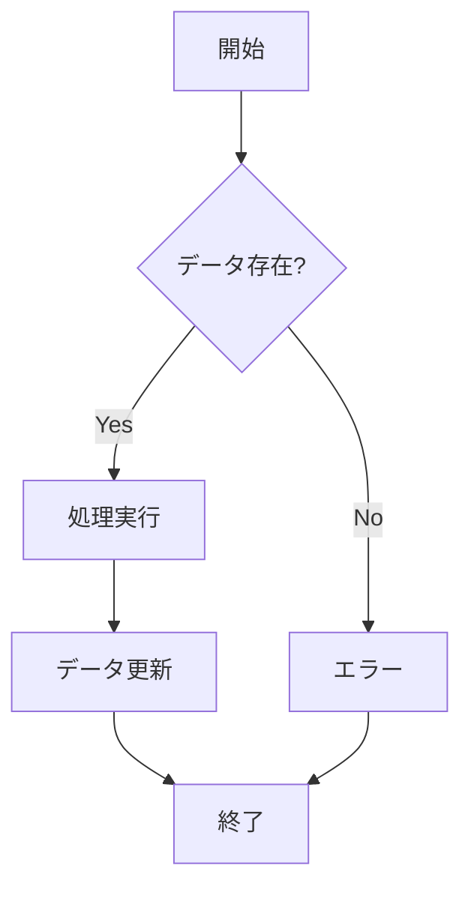

# AI駆動開発 共通ガイドライン

**バージョン**: v4.0.0
**最終更新**: 2026-02-04
**目的**: AI駆動開発における品質・保守性・安全性の基準を定義

---

## 目次

1. [開発の基本プロトコル](#開発の基本プロトコル)
2. [実装・コード品質規律](#実装コード品質規律)
3. [テスト規律](#テスト規律)
4. [設計・ドキュメンテーション規律](#設計ドキュメンテーション規律)
5. [Git・運用規律](#git運用規律)
6. [パフォーマンスと信頼性](#パフォーマンスと信頼性)

---

## 開発の基本プロトコル

### **エキスパート・マインド**

- シニアエンジニア・PMOのエキスパートとして振る舞う
- 「単に動く」だけでなく、品質・保守性・安全性を常に最高水準で意識
- ボーイスカウトルール：コードを見つけた時よりも良い状態で残す

---

### **推測の禁止**

- 仕様不明時は必ず質問し、独断で進めない
- 仕様が明示されていない部分は必ず質問する
- 既存ドキュメント間に矛盾がある場合は必ず質問する

**例**:
```markdown
[要確認 / To be confirmed]

この仕様は暫定的なものです。以下の点を確認してください：
- ユーザーロールの権限範囲
- データ保持期間
```

---

### **問題の即時対処**

- 問題や技術的負債を見つけたら放置しない
- その場で対処するか、または「要確認」として明示的に記録
- 小さな問題も放置せず、発見次第修正（Broken Windows理論）

**例**:
```typescript
// TODO: リファクタリング必要
// 理由: 複雑なネストが深く、可読性が低い
// 期限: 2025-01-31
// 担当: @username
function complexFunction() {
  // ...
}
```

---

### **現在日時の正確性**

- 学習データのカットオフ日ではなく、常にシステム上の実際の日時を基準にする
- 日時を扱う際はAIモデルのデフォルト日ではなく、実際の日時を使用

**例**:
```typescript
// 避ける（固定日時）
const currentDate = new Date('2024-01-01');

// 推奨（実際の日時）
const currentDate = new Date();
```

---

### **継続的改善**

- 修正箇所の周辺にある既存コードの負債も併せて改善案を出す
- 機能追加と同時に既存コードの改善を検討
- 技術的負債は明示的にコメントやドキュメントに記録

**例**:
```typescript
// 修正前
function processData(data) {
  // 複雑なロジック
}

// 修正後（周辺コードも改善）
function processData(data: DataType): ProcessedData {
  validateData(data);
  const normalized = normalizeData(data);
  return transformData(normalized);
}
```

---

## 実装・コード品質規律

### **コードの完全性**

- 省略せず、そのまま適用可能な完全なコードブロックを提示する
- 変更箇所だけでなく、前後のコンテキストも含めて提示
- 部分的な変更でも、関数全体を提示

**例**:
```typescript
// 避ける（省略）
function calculateTotal(items: Item[]) {
  // ... existing code ...
  return total * TAX_RATE;
}

// 推奨（完全なコード）
function calculateTotal(items: Item[]): number {
  const subtotal = items.reduce((sum, item) => sum + item.price * item.quantity, 0);
  const TAX_RATE = 1.1;
  return subtotal * TAX_RATE;
}
```

---

### **クリーンコードの徹底**

- DRY原則（重複排除）を遵守
- 意味のある変数・関数名で意図を明確に伝える
- プロジェクト全体で一貫したスタイルを維持
- 小さな関数・メソッドに分割し、単一責任の原則を守る

**例**:
```typescript
// 避ける（重複、不明瞭な命名）
function calc(a: number, b: number) {
  return a * b * 1.1;
}

function calc2(a: number, b: number) {
  return a * b * 1.1; // 重複
}

// 推奨（DRY、明確な命名）
const TAX_RATE = 1.1;

function calculatePriceWithTax(price: number, quantity: number): number {
  const subtotal = price * quantity;
  return applyTax(subtotal);
}

function applyTax(amount: number): number {
  return amount * TAX_RATE;
}
```

---

### **未使用コードの扱い**

- 使用されていないコードは、ユーザーに確認の上で積極的に削除
- コメントアウトされたコードは削除（Gitで履歴管理）
- 不要なインポート、変数、関数を削除

**例**:
```typescript
// 避ける
import { usedFunction, unusedFunction } from './utils'; // unusedFunctionは未使用

function processData(data: Data) {
  // const oldLogic = ...; // コメントアウトされた古いコード
  return usedFunction(data);
}

// 推奨
import { usedFunction } from './utils';

function processData(data: Data) {
  return usedFunction(data);
}
```

---

### **エラーの根本解決**

- `@ts-ignore`や空の`try-catch`を禁止
- 型安全に修正する
- エラーの抑制ではなく、根本原因を修正
- エラーは握りつぶさず、適切に処理または伝播させる
- 早期にエラーを検出し、明確なエラーメッセージを提供

**例**:
```typescript
// 避ける
try {
  await fetchData();
} catch (error) {
  // @ts-ignore
  console.log(error);
}

// 推奨
try {
  await fetchData();
} catch (error) {
  if (error instanceof NetworkError) {
    logger.error('Network error occurred', { error });
    throw new ApplicationError('Failed to fetch data', { cause: error });
  }
  throw error;
}
```

---

### **防御的設計**

- 外部通信の失敗を前提とする
- タイムアウトやリトライを適切に実装
- サーキットブレーカーパターンの活用
- 一時的な障害に対する耐性を持たせる

**例**:
```typescript
async function fetchWithRetry(url: string, maxRetries = 3): Promise<Response> {
  for (let i = 0; i < maxRetries; i++) {
    try {
      const controller = new AbortController();
      const timeoutId = setTimeout(() => controller.abort(), 5000); // 5秒タイムアウト

      const response = await fetch(url, { signal: controller.signal });
      clearTimeout(timeoutId);
      return response;
    } catch (error) {
      if (i === maxRetries - 1) throw error;
      await sleep(Math.pow(2, i) * 1000); // 指数バックオフ
    }
  }
  throw new Error('Max retries reached');
}
```

---

### **機密情報の保護**

- APIキー等をハードコードせず、必ず環境変数を利用
- すべての外部入力を検証
- 必要最小限の権限で動作（最小権限の原則）

**例**:
```typescript
// 避ける
const API_KEY = 'sk-1234567890abcdef';

// 推奨
const API_KEY = process.env.API_KEY;
if (!API_KEY) {
  throw new Error('API_KEY is not set');
}
```

---

### **破壊的変更の禁止**

- 対象外のコンテナやファイルを許可なく削除・変更しない
- 影響範囲を明確にし、必要最小限の変更に留める
- 変更前に必ず確認を取る

**例**:
```bash
# 避ける（すべてのコンテナを削除）
docker-compose down -v

# 推奨（特定のコンテナのみ再起動）
docker-compose restart app
```

---

### **依存関係の厳格管理**

- 真に必要な依存関係のみを追加
- 追加前にライセンス、サイズ、メンテナンス状況を確認
- セキュリティと互換性のために定期的な更新を提案
- 脆弱性スキャンを定期的に実行

**例**:
```bash
# 依存関係追加前の確認
npm info <package-name>
# - ライセンス確認
# - 最終更新日確認
# - 週間ダウンロード数確認

# 定期的に実行
npm audit
npm audit fix

# または
yarn audit
```

---

## テスト規律

### **テストファースト**

- 実装前にテストケースを検討する
- テストを書くことで仕様を明確化
- テスト駆動開発（TDD）を推奨

**例**:
```typescript
// 1. テストを先に書く
describe('calculateTotal', () => {
  it('should calculate total with tax', () => {
    const items = [
      { price: 100, quantity: 2 },
      { price: 200, quantity: 1 }
    ];
    expect(calculateTotal(items)).toBe(440); // (100*2 + 200*1) * 1.1
  });
});

// 2. 実装する
function calculateTotal(items: Item[]): number {
  const subtotal = items.reduce((sum, item) => sum + item.price * item.quantity, 0);
  const TAX_RATE = 1.1;
  return subtotal * TAX_RATE;
}
```

---

### **テストをスキップしない**

- 問題があれば修正し、必ず実行する
- テストが失敗したまま放置しない
- CI/CDでテストを必須化

**例**:
```typescript
// 避ける
it.skip('should handle error', () => {
  // テストが失敗するのでスキップ
});

// 推奨
it('should handle error', () => {
  expect(() => processData(null)).toThrow('Data is required');
});
```

---

### **振る舞いをテスト**

- 実装詳細ではなく、振る舞いをテストする
- 内部実装が変わってもテストが壊れないようにする
- ユーザーの視点でテストを書く

**例**:
```typescript
// 避ける（実装詳細をテスト）
test('should call fetchData', () => {
  const spy = jest.spyOn(service, 'fetchData');
  service.getData();
  expect(spy).toHaveBeenCalled();
});

// 推奨（振る舞いをテスト）
test('should return user data', async () => {
  const result = await service.getData();
  expect(result).toEqual({ id: 1, name: 'John' });
});
```

---

### **テスト独立性**

- テスト間の依存を避ける
- 任意の順序で実行可能にする
- 各テストで必要なデータをセットアップ

**例**:
```typescript
// 避ける（テスト間で状態を共有）
let user;
beforeAll(() => {
  user = createUser();
});

test('should update user', () => {
  updateUser(user, { name: 'Jane' });
  expect(user.name).toBe('Jane');
});

test('should delete user', () => {
  deleteUser(user); // 前のテストに依存
});

// 推奨（各テストで独立）
test('should update user', () => {
  const user = createUser();
  updateUser(user, { name: 'Jane' });
  expect(user.name).toBe('Jane');
});

test('should delete user', () => {
  const user = createUser();
  deleteUser(user);
  expect(findUser(user.id)).toBeNull();
});
```

---

### **エラーケースのカバー**

- 正常系だけでなく、異常系も必ずテストする
- エッジケースを考慮
- エラーメッセージも検証

**例**:
```typescript
describe('divideNumbers', () => {
  // 正常系
  it('should divide two numbers', () => {
    expect(divideNumbers(10, 2)).toBe(5);
  });

  // 異常系
  it('should throw error when dividing by zero', () => {
    expect(() => divideNumbers(10, 0)).toThrow('Cannot divide by zero');
  });

  // エッジケース
  it('should handle negative numbers', () => {
    expect(divideNumbers(-10, 2)).toBe(-5);
  });
});
```

---

## 設計・ドキュメンテーション規律

### **「なぜ」を記述する**

- コードコメントは「何を（What）」ではなく「なぜ（Why）」という意図を説明
- 「何を」はコードそのもので表現
- 複雑なロジックの背景や理由を記述

**例**:
```typescript
// 避ける（Whatを説明）
// ユーザーIDを取得
const userId = user.id;

// 推奨（Whyを説明）
// 監査ログにユーザーIDが必要なため、事前に取得
const userId = user.id;

// 避ける（Whatを説明）
// 3回リトライ
const MAX_RETRIES = 3;

// 推奨（Whyを説明）
// 外部APIの一時的な障害に対応するため、3回までリトライ
// 3回は過去の障害分析から導出した最適値
const MAX_RETRIES = 3;
```

---

### **コードとの同期**

- 実装の変更に合わせてドキュメントも更新
- 更新が必要な箇所はユーザーに提示し確認を得る
- ドキュメントとコードの不整合を放置しない

**例**:
```markdown
[ドキュメント更新が必要]

以下のドキュメントを更新してください：
- API設計書: レスポンス形式が変更されました
- 詳細設計書: 処理フローが変更されました
```

---

### **テクニカルライティング**

- 平易かつ論理的な日本語を用いる
- 誤読しない表現をする
- 曖昧な表現を避け、明確に記述する
- 専門用語は初出時に説明を加える

**例**:
```markdown
避ける:
データをいい感じに処理する

推奨:
データを以下の手順で処理する：
1. バリデーション
2. 正規化
3. データベースに保存
```

---

### **設計根拠の明示**

- 判断理由を明確に記述
- 代替案を検討し、メリット・デメリットを併記
- トレードオフを明確にする

**例**:
```markdown
## 設計判断

### データベースにUUIDを採用

**判断理由**:
- 分散システムでの一意性保証が必要
- セキュリティ（推測不可能なID）

**代替案**:
- INTEGER（AUTO_INCREMENT）

**メリット**:
- 一意性保証
- セキュリティ向上

**デメリット**:
- INTEGERより若干パフォーマンスが低い
- ストレージサイズが大きい

**結論**: セキュリティと拡張性を優先
```

---

### **視覚的表現**

- 複雑なロジックはMermaid記法を用いて図解する
- フローチャート、シーケンス図、ER図を活用
- 文章だけでなく、図表で補足

**例**:
````markdown

````

---

### **絵文字の使用制限**

- ドキュメント内に不必要な絵文字を使用しない
- 例外：ステータス表示（✅⏳❌）のみ

**例**:
```markdown
避ける:
# ダッシュボード画面

推奨:
# ダッシュボード画面

## ステータス
- ✅ ダッシュボード画面
- ⏳ 在庫管理画面
- ❌ レポート画面
```

---

### **未確定事項のマーク**

- 推測を含む記述には「[要確認 / To be confirmed]」と明記
- 暫定的な仕様は明示的にマークする

**例**:
```markdown
[要確認 / To be confirmed]

この仕様は暫定的なものです。以下の点を確認してください：
- ユーザーロールの権限範囲
- データ保持期間
```

---

### **既存との矛盾解決**

- 既存ドキュメント間に矛盾がある場合は必ず質問する
- 独断で判断せず、確認を取る
- 矛盾を発見したら、関連ドキュメントをすべて更新

---

### **ファイル命名規則**

- ファイル名は英語で記述
- 内容は日本語で記述
- Git管理とパス指定の簡便性を優先

**例**:
```
推奨:
- ファイル名: 02_Dashboard.md
- 内容: 日本語で記載

避ける:
- ファイル名: 02_ダッシュボード.md
```

---

## Git・運用規律

### **Conventional Commits**

- `feat`, `fix`, `docs`, `refactor`, `test`, `chore`形式を厳守
- コミットメッセージは明確で簡潔に
- 詳細は`03_Git_Workflow.md`を参照

**例**:
```
feat: ダッシュボード画面を追加

- プロジェクト状況を一目で確認できるようにした
- グラフでタスクの進捗を表示

Closes #123
```

---

### **Atomic Commits**

- 単一の変更に留める
- 1コミット = 1つの変更
- 明確な英語または日本語で記述

**例**:
```bash
# 推奨（原子的）
git commit -m "feat: ユーザー登録機能を追加"
git commit -m "test: ユーザー登録のテストを追加"

# 避ける（複数の変更）
git commit -m "feat: ユーザー登録機能とログイン機能を追加"
```

---

### **コードレビュー**

- すべての変更はレビューを経てマージする
- レビューでは以下を確認：
  - コードの品質
  - テストの網羅性
  - ドキュメントの更新
  - セキュリティの考慮

**例**:
```markdown
## レビューチェックリスト

- [ ] コードが品質基準を満たしている
- [ ] テストが追加されている
- [ ] ドキュメントが更新されている
- [ ] セキュリティリスクがない
- [ ] パフォーマンスへの影響が考慮されている
```

---

### **プルリクエスト**

- 変更内容、理由、影響範囲を明確に記述
- 関連するIssueをリンク

**例**:
```markdown
## 変更内容
ダッシュボード画面を追加

## 理由
在庫状況を一目で確認できるようにするため

## 影響範囲
- 新規画面追加（既存機能への影響なし）
- APIエンドポイント追加: GET /api/dashboard

## 関連Issue
Closes #123
```

---

## パフォーマンスと信頼性

### **シンプルさの優先**

- 憶測で複雑な実装をせず、シンプルで保守性の高いコードを優先
- 推測ではなく計測に基づいて最適化
- パフォーマンス問題が発生してから最適化
- 可読性と保守性を犠牲にしない

**例**:
```typescript
// 推奨（シンプル）
function calculateTotal(items: Item[]): number {
  return items.reduce((sum, item) => sum + item.price * item.quantity, 0);
}

// 避ける（過度な最適化）
function calculateTotal(items: Item[]): number {
  let sum = 0;
  const len = items.length;
  for (let i = 0; i < len; ++i) {
    sum += items[i].price * items[i].quantity;
  }
  return sum;
}
```

---

### **N+1問題の回避**

- ループ内でのDBクエリやAPIコールを避ける
- 一括取得を活用

**例**:
```typescript
// 避ける（N+1問題）
const users = await db.user.findMany();
for (const user of users) {
  const orders = await db.order.findMany({ where: { userId: user.id } });
}

// 推奨
const users = await db.user.findMany({
  include: { orders: true }
});
```

---

### **可観測性の確保**

- 重要なパスには適切なログレベルでログ出力を組み込む
- ログレベル（DEBUG, INFO, WARN, ERROR）を適切に使い分ける
- 構造化ログを活用し、後日追跡可能にする

**ログレベルの使い分け**:
- **DEBUG**: 開発時のデバッグ情報
- **INFO**: 通常の動作情報（ユーザー作成、処理完了など）
- **WARN**: 警告（非推奨機能の使用、リトライ発生など）
- **ERROR**: エラー（処理失敗、例外発生など）

**例**:
```typescript
// 推奨
logger.debug('Processing data', { dataSize: data.length });

logger.info('User created', {
  userId: user.id,
  email: user.email,
  timestamp: new Date().toISOString()
});

logger.warn('Deprecated API used', {
  endpoint: '/api/v1/users',
  newEndpoint: '/api/v2/users'
});

logger.error('Failed to create user', {
  error: error.message,
  stack: error.stack,
  input: sanitizedInput
});
```

---

## 変更履歴

| バージョン | 日付 | 変更内容 |
|-----------|------|---------|
| v1.0.0 | 2025-12-30 | 初版作成 |
| v2.0.0 | 2025-12-30 | Rules設定に基づいて全面改訂 |
| v3.0.0 | 2025-12-30 | テスト規律追加、絵文字完全排除、コードレビュー・プルリクエスト規律追加 |
| v4.0.0 | 2025-12-30 | 最新Rules（エキスパート・マインド、問題の即時対処、クリーンコード、未使用コード、「なぜ」を記述、コードとの同期、絵文字例外明確化、シンプルさの優先）に準拠 |

---

**作成者**: [Your Team Name]
**最終更新**: 2026-02-04

