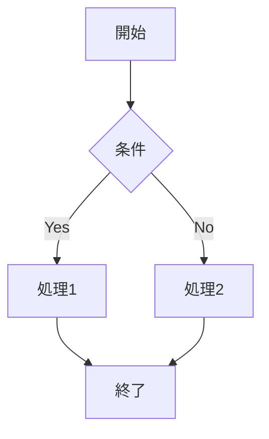
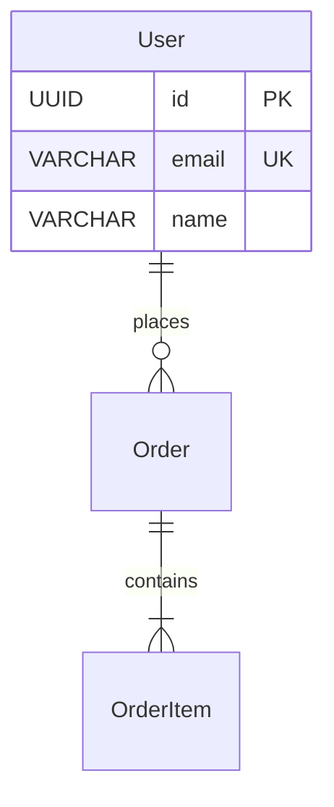
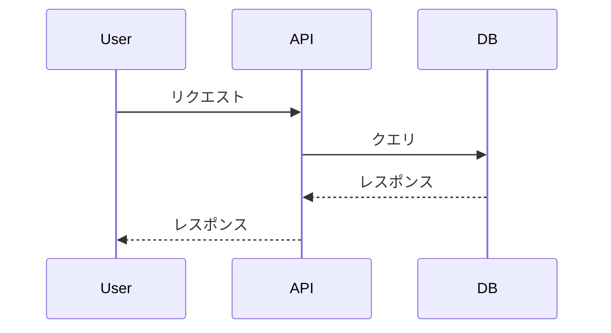

# ドキュメント基準

**バージョン**: v1.2.0
**最終更新**: 2026-02-05
**目的**: ドキュメント作成の基準とベストプラクティスを定義

---

## 目次

1. [ドキュメントの原則](#ドキュメントの原則)
2. [ドキュメント構成](#ドキュメント構成)
3. [ファイル命名規則](#ファイル命名規則)
4. [記載粒度](#記載粒度)
5. [Markdown記法](#markdown記法)
6. [図表の作成](#図表の作成)
7. [バージョン管理](#バージョン管理)
8. [整合性確認](#整合性確認)
9. [ドキュメント完成定義（DoD）](#ドキュメント完成定義dod)

---

## ドキュメントの原則

### **ドキュメントの目的**

1. **知識の共有**
   - チームメンバー間で知識を共有
   - 新メンバーのオンボーディングを容易に

2. **設計の記録**
   - 設計判断の理由を記録
   - 将来の変更時に参照

3. **保守性の向上**
   - コードとドキュメントを同期
   - 変更履歴を追跡

---

### **ドキュメントの基準**

- **明確**: 曖昧な表現を避ける
- **簡潔**: 必要な情報のみを記載
- **最新**: コードと同期して更新
- **実例**: 具体例を示す
- **検索可能**: 適切な見出しとキーワード

- **絵文字の節度**: ドキュメント本文では装飾目的の絵文字は使用しない（例外としてステータス表現の ✅⏳❌ のみ許可）

---

### **未確定事項の記載方法**

- 推測や未確定の情報には `[要確認 / To be confirmed]` を付ける
- 確認してほしい論点を箇条書きで明示する

**例**:
```markdown
[要確認 / To be confirmed]

この仕様は暫定です。以下の点を確認してください：
- 在庫の締め時間
- タイムゾーン（JST/UTC）
```

---

## ドキュメント構成

### **ディレクトリ構成**

```
Documents/
├── 00_Project_Guidelines/          # プロジェクトガイドライン
├── 01_Database_Design/             # データベース設計
├── 02_Technical_Design/            # 技術設計
├── 03_Business_Process/            # ビジネスプロセス
├── 04_UI_UX_Design/                # UI/UX設計
├── 05_API_Design/                  # API設計
├── 06_Detailed_Design/             # 詳細設計
├── 07_Test_Design/                 # テスト設計
└── 09_Archive/                     # アーカイブ
```

---

### **各ディレクトリの役割**

| ディレクトリ | 内容 | 対象読者 |
|------------|------|---------|
| **00_Project_Guidelines** | プロジェクト全体のガイドライン | 全員 |
| **01_Database_Design** | データベース設計書 | 開発者、DBA |
| **02_Technical_Design** | 技術スタック、インフラ設計 | 開発者、インフラ担当 |
| **03_Business_Process** | ビジネスプロセス、要件定義 | 全員 |
| **04_UI_UX_Design** | 画面設計、モックアップ | デザイナー、開発者 |
| **05_API_Design** | API設計書 | 開発者 |
| **06_Detailed_Design** | 詳細設計書 | 開発者 |
| **07_Test_Design** | テスト仕様書 | QA、開発者 |

---

## ファイル命名規則

### **統一ルール**

- **ファイル名**: 英語（Git管理、パス指定の簡便性）
- **内容**: 日本語（開発チームが日本語話者、正確な意図伝達）

---

### **命名規則**

| ドキュメント種別 | 形式 | 例 |
|----------------|------|-----|
| **ガイドライン** | `00_[Type]_Guidelines.md` | `00_Database_Design_Guidelines.md` |
| **テンプレート** | `00_[Type]_Template.md` | `00_Database_Design_Template.md` |
| **README** | `README.md` | `README.md` |
| **設計書** | `[番号]_[Function_Name].md` | `02_Dashboard.md` |
| **API設計書** | `[番号]_[Function_Name]_API.md` | `02_Dashboard_API.md` |
| **詳細設計書** | `[番号]_[Function_Name]_Detailed_Design.md` | `02_Dashboard_Detailed_Design.md` |

---

### **番号の付け方**

- **2桁**: `01`, `02`, `03`, ...
- **機能順**: ビジネスプロセスの順序に従う
- **一貫性**: 画面設計書、API設計書、詳細設計書で番号を揃える

**例**:
- `02_Dashboard.md` （画面設計書）
- `02_Dashboard_API.md` （API設計書）
- `02_Dashboard_Detailed_Design.md` （詳細設計書）
- `02_Dashboard_Test_Spec.md` （テスト仕様書）

---

## 記載粒度

### **記載する情報**

| ドキュメント | 記載粒度 | コード記載 |
|------------|---------|-----------|
| **画面設計書** | 画面要素、レイアウト、基本機能 | ❌ なし |
| **詳細設計書** | 処理フロー、ロジック概要 | ※ 疑似コードのみ |
| **API設計書** | リクエスト/レスポンス、型定義 | ※ 型定義のみ |
| **テスト仕様書** | テストケース | ❌ なし |
| **技術設計書** | 技術スタック、共通仕様 | ※ package.jsonのみ |

---

### **記載しない情報**

- ❌ 実装コード（ソースコードを参照）
- ❌ 実装ツール固有の設定（Prisma、TypeORM等）
- ❌ 重複情報（他のドキュメントを参照）

---

## Markdown記法

### **見出し**

```markdown
# 見出し1（ドキュメントタイトル）
## 見出し2（セクション）
### 見出し3（サブセクション）
#### 見出し4（詳細）
```

---

### **リスト**

```markdown
- 箇条書き
  - ネスト
    - さらにネスト

1. 番号付きリスト
2. 番号付きリスト
   1. ネスト
```

---

### **テーブル**

```markdown
| カラム1 | カラム2 | カラム3 |
|--------|--------|--------|
| データ1 | データ2 | データ3 |
| データ4 | データ5 | データ6 |
```

---

### **コードブロック**

````markdown
```typescript
function example() {
  console.log('Hello, World!');
}
```
````

---

### **リンク**

```markdown
[リンクテキスト](URL)
[相対パス](../01_Database_Design/README.md)
```

---

### **強調**

```markdown
**太字**
*斜体*
~~取り消し線~~
```

---

### **チェックボックス**

```markdown
- [ ] 未完了
- [x] 完了
```

---

## 図表の作成

### **Mermaid図**

```markdown

```

---

### **ER図**

```markdown

```

---

### **シーケンス図**

```markdown

```

---

## バージョン管理

### **バージョン番号規則**

セマンティックバージョニングを採用：`Major.Minor.Patch`

- **Major（メジャー）**: アーキテクチャの大幅変更、互換性のない変更
- **Minor（マイナー）**: 機能追加、後方互換性のある変更
- **Patch（パッチ）**: 誤記修正、軽微な修正

例：`v1.2.3`
- 1: メジャーバージョン
- 2: マイナーバージョン
- 3: パッチバージョン

---

### **ドキュメントヘッダー必須項目**

すべてのドキュメントの冒頭に以下を記載：

```markdown
---
ドキュメントID: {カテゴリ}-{連番}
タイトル: {ドキュメント名}
バージョン: {Major.Minor.Patch}
作成日: YYYY-MM-DD
最終更新日: YYYY-MM-DD
作成者: {担当者名}
承認者: {承認者名}
ステータス: [Draft|Review|Approved|Deprecated]
---
```

**ステータス定義**:

| ステータス | 意味 | 次のアクション |
|-----------|------|---------------|
| Draft | 作成中 | レビュー依頼 |
| Review | レビュー中 | フィードバック対応 |
| Approved | 承認済み | 実装開始可能 |
| Deprecated | 廃止 | 参照のみ（更新不可） |

---

### **変更履歴**

各ドキュメントの末尾に変更履歴を記載:

```markdown
## 変更履歴

| バージョン | 日付 | 変更者 | 変更内容 | 承認者 |
|-----------|------|--------|----------|--------|
| v1.0.0 | 2024-01-15 | 山田太郎 | 初版作成 | 佐藤花子 |
| v1.1.0 | 2024-02-01 | 山田太郎 | 機能追加 | 佐藤花子 |
```

---

### **重大変更の記録**

以下の変更は詳細な記録が必須：
- アーキテクチャパターンの変更
- データモデルの構造変更
- API仕様の破壊的変更
- セキュリティポリシーの変更
- 非機能要件の変更

記録内容：
- 変更前の状態
- 変更後の状態
- 変更理由（ビジネス要因・技術要因）
- 検討した代替案
- 選択した理由
- 影響を受けるシステム・コンポーネント

---

## 整合性確認

### **チェックリスト**

- [ ] ファイル名が命名規則に従っている
- [ ] 見出しが適切に設定されている
- [ ] リンクが正しく機能している
- [ ] コードブロックが正しく表示されている
- [ ] 図表が正しく表示されている
- [ ] 変更履歴が更新されている
- [ ] 関連ドキュメントへのリンクが設定されている

---

### **関連ドキュメントの整合性**

```markdown
## 関連ドキュメント

### 参照元
- **ビジネスプロセス**: `../01_Business_Process/requirements/`
- **画面設計書**: `../04_Screen_Design/02_Project_List.md`

### 参照先
- **API設計書**: `../05_API_Design/02_Project_API.md`
- **詳細設計書**: `../06_Detailed_Design/02_Project_List_Detailed_Design.md`
```

---

### **不必要な絵文字の使用禁止**

```markdown
❌ 避ける
# 🎉 ダッシュボード画面 🚀

✅ 推奨
# ダッシュボード画面
```

**例外**: チェックリスト、ステータス表示
```markdown
✅ 完成
⏳ 作成中
❌ 未着手
```

---

### **推測の明示**

```markdown
🚧 要確認 / To be confirmed

この仕様は暫定的なものです。顧客との確認が必要です。
```

---

## ドキュメント完成定義（DoD）

### **画面設計書の完成定義**

- [ ] 画面ID・画面名が明確に定義されている
- [ ] 画面レイアウト図が含まれている（Mermaid図または説明）
- [ ] すべての画面要素（ボタン、入力フィールド等）が定義されている
- [ ] 画面遷移が明確に定義されている
- [ ] バリデーションルールが定義されている
- [ ] 関連するAPIが紐付けられている
- [ ] 関連するデータベーステーブルが紐付けられている
- [ ] レビュー済みでステータスが「Approved」
- [ ] バージョン情報と変更履歴が記載されている

### **API設計書の完成定義**

- [ ] すべてのエンドポイントが定義されている
- [ ] HTTPメソッドが適切に選択されている
- [ ] リクエストスキーマが定義されている
- [ ] レスポンススキーマが定義されている（成功・エラー両方）
- [ ] 認証・認可方式が明記されている
- [ ] エラーコード一覧が定義されている
- [ ] レート制限が定義されている（該当する場合）
- [ ] バージョニング戦略が記述されている
- [ ] シーケンス図が含まれている（複雑なフローの場合）
- [ ] レビュー済みでステータスが「Approved」

### **データベース設計書の完成定義**

- [ ] ER図（Mermaid）が含まれている
- [ ] すべてのテーブルに主キーが定義されている
- [ ] 外部キー制約が定義されている
- [ ] インデックス戦略が記述されている
- [ ] データ整合性ルールが定義されている
- [ ] データ移行戦略が記述されている（既存システムがある場合）
- [ ] パフォーマンス考慮事項が記述されている
- [ ] レビュー済みでステータスが「Approved」

### **詳細設計書の完成定義**

- [ ] 処理フローが明確に定義されている
- [ ] ビジネスロジックが記述されている
- [ ] エラーハンドリング方針が記述されている
- [ ] 状態管理方針が記述されている
- [ ] シーケンス図が含まれている（複雑な処理の場合）
- [ ] 関連する画面設計・API設計が紐付けられている
- [ ] レビュー済みでステータスが「Approved」

### **完成度チェックの実施タイミング**

- ドキュメント作成完了時
- レビュー前
- 承認前
- マイルストーン到達時

### **完成度チェックの責任者**

- **作成者**: 初回チェック（セルフレビュー）
- **レビュアー**: 詳細チェック
- **承認者**: 最終チェック

---

**作成者**: [Your Team Name]
**最終更新**: 2026-02-05

