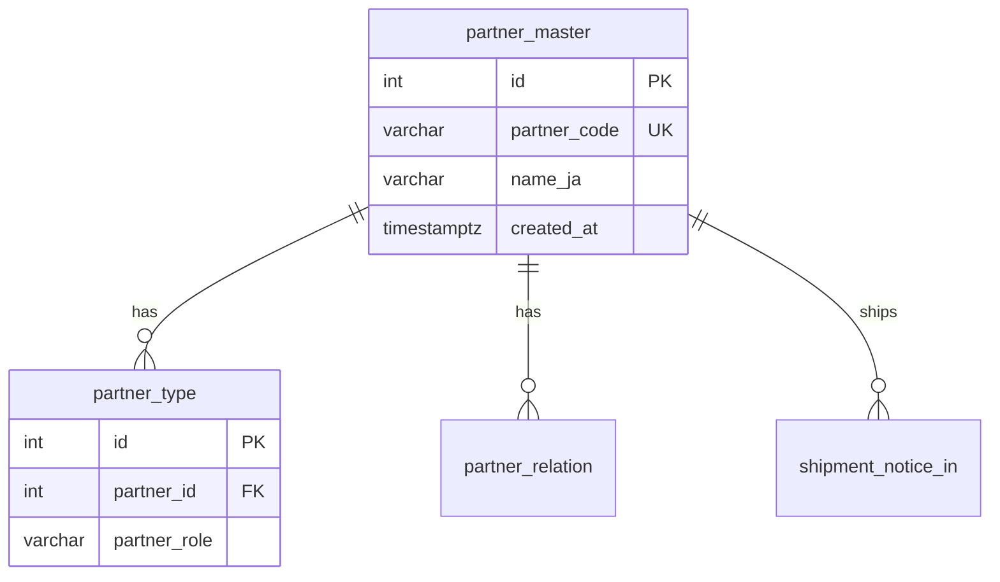
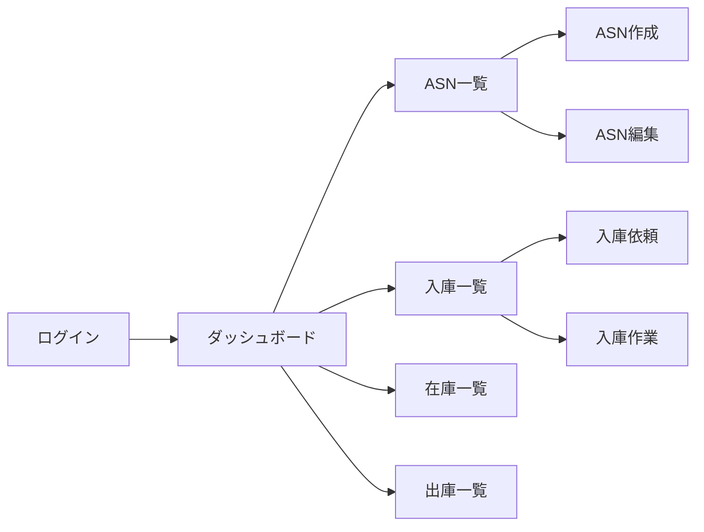

# 設計実施ガイド - 具体的な手順

**作成日**: 2026-01-05
**バージョン**: v1.0.0
**目的**: 設計プロセスワークフローの具体的な実施手順を定義

---

## 目次

1. [概要](#概要)
2. [Phase 2: データベース設計詳細化の実施手順](#phase-2-データベース設計詳細化の実施手順)
3. [Phase 3: 画面設計詳細化の実施手順](#phase-3-画面設計詳細化の実施手順)
4. [Phase 4: API設計の実施手順](#phase-4-api設計の実施手順)
5. [Phase 5: 詳細設計の実施手順](#phase-5-詳細設計の実施手順)
6. [整合性確認の実施手順](#整合性確認の実施手順)
7. [AI活用のベストプラクティス](#ai活用のベストプラクティス)

---

## 概要

### **このガイドの使い方**

1. **設計プロセスワークフロー**（`05_Design_Process_Workflow.md`）で全体像を把握
2. **このガイド**で具体的な実施手順を確認
3. **各ガイドライン・テンプレート**で詳細を確認

### **前提条件**

- [ ] `05_Design_Process_Workflow.md` を読んでいる
- [ ] 各設計書のガイドライン・テンプレートを確認している
- [ ] Phase 1（要件確認・基盤整備）が完了している

---

## Phase 2: データベース設計詳細化の実施手順

### **ステップ1: マスタテーブル設計書作成**

#### **1-1. テンプレートをコピー**

```bash
# テンプレートをコピー
cp Documents/01_Database_Design/00_Database_Design_Template.md \
   Documents/01_Database_Design/02_Table_Design_Master.md
```

#### **1-2. 対象テーブルを特定**

**参照**: `er_dictionary_process_flow_order.csv` の「マスタデータ群」セクション

**対象テーブル**:
- partner_master（取引先マスタ）
- partner_type（取引先区分）
- partner_relation（取引先関係）
- partner_whs_preference（取引先倉庫優先度）
- warehouse（倉庫）
- room_type（ルーム種別マスタ）
- room（ルーム）
- location（ロケーション）
- origin_country（原産国マスタ）
- package_type（荷姿マスタ）
- destination（仕向地マスタ）
- user_master（ユーザマスタ）
- time_band_master（時間帯マスタ）
- vehicle_type_master（車両マスタ）
- customs_class_master（通関区分マスタ）
- selection_master（選択肢マスタ）

#### **1-3. テーブル設計書を記載**

**記載内容**（テンプレートに従う）:

1. **テーブル概要**
   - テーブル名（物理名、論理名）
   - 目的・役割
   - ビジネスルール

2. **カラム定義**
   - カラム名（物理名、論理名）
   - データ型
   - NULL制約
   - デフォルト値
   - 説明

3. **制約**
   - PRIMARY KEY
   - FOREIGN KEY
   - UNIQUE
   - CHECK

4. **インデックス**
   - 検索性能向上のためのインデックス

5. **リレーション**
   - 他テーブルとの関係

**例**（partner_master）:

```markdown
### partner_master（取引先マスタ）

#### **テーブル概要**

**目的**: 取引先の基本情報を管理

**ビジネスルール**:
- partner_code は5文字固定
- 論理削除は使用しない（マスタは物理削除）

#### **カラム定義**

| カラム名 | 論理名 | データ型 | NULL | デフォルト | 説明 |
|---------|--------|---------|------|-----------|------|
| id | 取引先ID | int | NOT NULL | AUTO_INCREMENT | 主キー |
| partner_code | 取引先コード | varchar(5) | NOT NULL | - | 5文字固定、ユニーク |
| name_en | 名称（英） | varchar(64) | NULL | - | 英語名称 |
| name_ja | 名称（和） | varchar(32) | NOT NULL | - | 日本語名称 |
| address | 所在地 | varchar(64) | NULL | - | 住所 |
| phone | 電話番号 | varchar(13) | NULL | - | ハイフン含む |
| email | メールアドレス | varchar(64) | NULL | - | - |
| created_at | 作成日時 | timestamptz | NOT NULL | CURRENT_TIMESTAMP | - |
| created_by | 作成者 | int | NOT NULL | - | user_master.id |

#### **制約**

- PRIMARY KEY: `id`
- UNIQUE: `partner_code`
- FOREIGN KEY: `created_by` → `user_master.id`

#### **インデックス**

- `idx_partner_code` ON `partner_code` (検索用)
- `idx_name_ja` ON `name_ja` (検索用)

#### **リレーション**

- `partner_type.partner_id` → `partner_master.id` (1:N)
- `partner_relation.partner_id` → `partner_master.id` (1:N)
```

#### **1-4. 整合性確認**

**確認項目**:
- [ ] すべてのカラムにデータ型が定義されている
- [ ] すべてのカラムにNULL制約が明示されている
- [ ] 主キーが定義されている
- [ ] 外部キーが定義されている
- [ ] インデックスが適切に設計されている

### **ステップ2: トランザクションテーブル設計書作成**

**対象**: `03_Table_Design_Transaction.md`

**対象テーブル例**:
- tasks（タスク）
- task_assignments（タスク担当者）
- task_comments（タスクコメント）
- task_attachments（タスク添付ファイル）
- projects（プロジェクト）
- project_members（プロジェクトメンバー）

**実施手順**: ステップ1と同様

### **ステップ3: トラッキングテーブル設計書作成**

**対象**: `04_Table_Design_Tracking.md`

**対象テーブル**:
- inventory_holds（在庫ホールド履歴）
- inventory_transfer（在庫移動実績）
- inventory_allocation（在庫引当）
- inventory_inspection（検疫結果）
- event_log（イベントログ）
- attachment（添付ファイル）

**実施手順**: ステップ1と同様

### **ステップ4: ER図作成**

**対象**: `05_ER_Diagram.md`

#### **4-1. Mermaid形式でER図を作成**

**例**:



#### **4-2. リレーションを明記**

- `||--o{`: 1対多
- `||--||`: 1対1
- `}o--o{`: 多対多

### **ステップ5: 制約・インデックス設計**

**対象**: `06_Constraints_Indexes.md`

**記載内容**:
- すべてのPRIMARY KEY
- すべてのFOREIGN KEY
- すべてのUNIQUE制約
- すべてのCHECK制約
- すべてのインデックス

---

## Phase 3: 画面設計詳細化の実施手順

### **ステップ1: 画面一覧・遷移図の更新**

**対象**: `Documents/04_UI_UX_Design/screen_design/01_Screen_List_Transition.md`

#### **1-1. モックアップから画面を洗い出す**

**参照**: `Documents/04_UI_UX_Design/mockups_v3/`

**画面一覧**:
- ログイン（`login.html`）
- ダッシュボード（`dashboard.html`）
- ASN作成（`asn/create.html`）
- ASN編集（`asn/edit.html`）
- ADN作成（`adn/create.html`）
- ADN編集（`adn/edit.html`）
- 入庫依頼（`inbound/request.html`）
- 入庫作業（`inbound/work.html`）
- 入庫詳細（`inbound/detail.html`）
- 在庫一覧（`inventory/list.html`）
- 在庫詳細（`inventory/detail.html`）
- 在庫移動（`inventory/operation.html`）
- 出庫依頼（`outbound/request.html`）
- ピッキング（`outbound/picking.html`）
- 出庫検品（`outbound/inspection.html`）
- バンニング依頼（`vanning/request.html`）
- バンニング作業（`vanning/work.html`）

#### **1-2. 画面遷移図を作成**

**Mermaid形式**:



### **ステップ2: 画面設計書作成（機能単位）**

#### **2-1. ダッシュボード設計書作成**

**対象**: `Documents/04_UI_UX_Design/screen_design/02_Dashboard.md`

**手順**:

1. **テンプレートをコピー**
   ```bash
   cp Documents/04_UI_UX_Design/screen_design/00_Screen_Design_Template.md \
      Documents/04_UI_UX_Design/screen_design/02_Dashboard.md
   ```

2. **画面概要を記載**
   - 画面ID: SCR-01
   - 画面名: ダッシュボード
   - URL: /dashboard
   - モックアップ: dashboard.html
   - 対応デバイス: PC

3. **画面レイアウトを記載**
   - ヘッダー（共通）
   - サイドバー（共通）
   - メインコンテンツ
     - アラート表示エリア
     - 統計カード（入庫予定、出庫予定、在庫数、アラート数）
     - 最近の活動

4. **画面要素詳細を記載**
   - 統計カード
     - 入庫予定件数（今日、今週）
     - 出庫予定件数（今日、今週）
     - 在庫数（総数、ホールド数）
     - アラート数（未対応）

5. **機能仕様を記載**
   - 画面ロード時にダッシュボードデータを取得
   - 統計カードクリックで詳細画面へ遷移
   - アラートクリックで対象画面へ遷移

6. **データ要件を記載**
   - API: `GET /api/v1/dashboard/summary`
   - テーブル: shipment_notice_in, shipment_notice_out, inventory

7. **画面遷移を記載**
   - 入庫予定カード → 入庫一覧
   - 出庫予定カード → 出庫一覧
   - 在庫カード → 在庫一覧

#### **2-2. ASN/ADN管理設計書作成**

**対象**: `Documents/04_UI_UX_Design/screen_design/03_ASN_ADN_Management.md`

**手順**: ステップ2-1と同様

**記載内容**:
- ASN一覧画面
- ASN作成画面
- ASN編集画面
- ADN一覧画面
- ADN作成画面
- ADN編集画面

#### **2-3. その他の画面設計書作成**

**対象**:
- `04_Inbound_Process.md`（入庫工程）
- `05_Inventory_Management.md`（在庫管理）
- `06_Labeling_Quarantine.md`（ラベリング・検疫工程）
- `07_Outbound_Process.md`（出庫工程）
- `08_Master_System_Management.md`（マスタ・システム管理）

**手順**: ステップ2-1と同様

### **ステップ3: データ要件の整合性確認**

#### **3-1. 画面-DB整合性チェック**

**確認項目**:
- [ ] 画面で表示するデータがDB設計に存在するか
- [ ] 画面で入力するデータがDB設計に存在するか
- [ ] データ型が一致しているか

**ツール**: マトリクス表

**例**:

| 画面 | 表示項目 | DBテーブル | DBカラム | 整合性 |
|------|---------|-----------|---------|--------|
| ダッシュボード | 入庫予定件数 | shipment_notice_in | COUNT(*) | ✅ |
| ダッシュボード | 出庫予定件数 | shipment_notice_out | COUNT(*) | ✅ |
| ASN作成 | 荷主 | partner_master | name_ja | ✅ |

#### **3-2. 不一致時の対応**

**パターン1**: DB設計に不足がある場合
- DB設計を修正（Phase 2に戻る）

**パターン2**: 画面設計がモックアップと矛盾する場合
- 顧客に確認
- モックアップまたは画面設計を修正

---

## Phase 4: API設計の実施手順

### **ステップ1: 画面からAPIを洗い出す**

#### **1-1. 画面設計書からAPIを抽出**

**例**（ダッシュボード）:

| 画面 | 機能 | 必要なAPI | HTTPメソッド |
|------|------|----------|-------------|
| ダッシュボード | 統計表示 | GET /api/v1/dashboard/summary | GET |
| ダッシュボード | アラート一覧 | GET /api/v1/dashboard/alerts | GET |

**例**（ASN管理）:

| 画面 | 機能 | 必要なAPI | HTTPメソッド |
|------|------|----------|-------------|
| ASN一覧 | 一覧取得 | GET /api/v1/asn | GET |
| ASN作成 | 新規作成 | POST /api/v1/asn | POST |
| ASN編集 | 詳細取得 | GET /api/v1/asn/:id | GET |
| ASN編集 | 更新 | PUT /api/v1/asn/:id | PUT |
| ASN編集 | 削除 | DELETE /api/v1/asn/:id | DELETE |

### **ステップ2: API設計書作成**

#### **2-1. テンプレートをコピー**

```bash
cp Documents/05_API_Design/00_API_Design_Template.md \
   Documents/05_API_Design/05_Inbound_API.md
```

#### **2-2. エンドポイント一覧を記載**

**例**（入庫API）:

| エンドポイント | メソッド | 説明 | Phase |
|--------------|---------|------|-------|
| /api/v1/inbound/requests | GET | 入庫依頼一覧取得 | Phase 1 |
| /api/v1/inbound/requests | POST | 入庫依頼作成 | Phase 1 |
| /api/v1/inbound/requests/:id | GET | 入庫依頼詳細取得 | Phase 1 |
| /api/v1/inbound/requests/:id | PUT | 入庫依頼更新 | Phase 1 |
| /api/v1/inbound/receipts | POST | 入庫実績登録 | Phase 1 |

#### **2-3. API詳細を記載**

**例**（入庫依頼作成API）:

```markdown
### POST /api/v1/inbound/requests

**説明**: 入庫依頼を作成

**リクエスト**:

```typescript
interface CreateInboundRequestRequest {
  doc_id: number;                    // 入庫予定ID
  request_sequence: number;          // 依頼シーケンス
  movo_reservation_no: string;       // MOVO予約管理番号
  shipper?: string;                 // 納品者
  carrier?: string;                  // 運送会社
  delivery_on?: string;              // 納品予定日（YYYY-MM-DD）
  planned_band_id?: number;          // 作業予定帯ID
  due_on?: string;                   // 期限日（YYYY-MM-DD）
  due_band_id?: number;              // 期限時間帯ID
  items: {
    plan_item_id: number;            // 予定明細ID
    requested_qty: number;           // 依頼数量
  }[];
}
```

**レスポンス**:

```typescript
interface InboundRequestResponse {
  id: number;
  request_no: string;
  doc_id: number;
  status: string;
  created_at: string;
  items: {
    id: number;
    plan_item_id: number;
    requested_qty: number;
  }[];
}
```

**バリデーション**:
- doc_id: 必須、存在するshipment_notice_in.id
- request_sequence: 必須、正の整数
- movo_reservation_no: 必須、32文字以内
- items: 必須、1件以上
- items[].plan_item_id: 必須、存在するshipment_notice_in_item.id
- items[].requested_qty: 必須、正の数値
```

#### **2-4. TypeScript型定義を記載**

**共通型**:
- PaginationParams
- PaginationMeta
- ErrorResponse

**API固有型**:
- CreateInboundRequestRequest
- InboundRequestResponse
- InboundRequestListResponse

### **ステップ3: API-DB整合性確認**

**確認項目**:
- [ ] リクエストパラメータがDB設計と一致しているか
- [ ] レスポンスデータがDB設計と一致しているか
- [ ] 外部キー制約が考慮されているか

---

## Phase 5: 詳細設計の実施手順

### **ステップ1: ビジネスロジック設計**

#### **1-1. 処理フローを疑似コードで記述**

**例**（ASN作成処理）:

```
ASN作成処理:
  入力: CreateAsnRequest
  出力: AsnResponse

  1. バリデーション
     - 荷主IDが存在するか確認
     - 仕向地コードが存在するか確認
     - 入庫予定日が未来日か確認

  2. ASN番号自動採番
     - フォーマット: ASN-YYYYMMDD-XXXX
     - XXXXは当日の連番（0001から開始）

  3. トランザクション開始

  4. shipment_notice_in テーブルに登録
     - doc_no: 採番したASN番号
     - warehouse_id: リクエストから取得
     - owner_id: リクエストから取得
     - status: "Draft"
     - created_at: 現在日時
     - created_by: ログインユーザID

  5. shipment_notice_in_item テーブルに明細を登録
     - 各明細をループ
     - doc_id: 登録したshipment_notice_in.id
     - line_no: 連番（1から開始）
     - case_no: リクエストから取得
     - その他の項目: リクエストから取得

  6. event_log テーブルに記録
     - entity_type: "shipment_notice_in"
     - entity_id: 登録したshipment_notice_in.id
     - action: "created"
     - occurred_by: ログインユーザID

  7. トランザクションコミット

  8. レスポンス返却
     - 登録したASNデータを返却

  エラー時:
    - トランザクションロールバック
    - エラーレスポンス返却
```

#### **1-2. ステータス遷移ロジック**

**例**（ASNステータス遷移）:

```
ASNステータス遷移:
  Draft → Submitted → Confirmed → Completed → Cancelled

  Draft（下書き）:
    - 作成直後の状態
    - 編集可能
    - 削除可能

  Submitted（提出済み）:
    - 承認待ち
    - 編集不可
    - 削除不可

  Confirmed（確認済み）:
    - 承認済み
    - 入庫依頼作成可能
    - 編集不可

  Completed（完了）:
    - すべての入庫依頼が完了
    - 編集不可
    - 削除不可

  Cancelled（キャンセル）:
    - キャンセル済み
    - 編集不可
    - 削除不可
```

### **ステップ2: 状態管理設計**

#### **2-1. Pinia Store設計**

**例**（ASN Store）:

```typescript
// stores/asn.ts
interface AsnState {
  asnList: Asn[];
  currentAsn: Asn | null;
  loading: boolean;
  error: string | null;
}

const useAsnStore = defineStore('asn', {
  state: (): AsnState => ({
    asnList: [],
    currentAsn: null,
    loading: false,
    error: null,
  }),

  getters: {
    draftAsns: (state) => state.asnList.filter(asn => asn.status === 'Draft'),
    submittedAsns: (state) => state.asnList.filter(asn => asn.status === 'Submitted'),
  },

  actions: {
    async fetchAsnList() {
      this.loading = true;
      try {
        const response = await api.get('/api/v1/asn');
        this.asnList = response.data;
      } catch (error) {
        this.error = error.message;
      } finally {
        this.loading = false;
      }
    },

    async createAsn(data: CreateAsnRequest) {
      this.loading = true;
      try {
        const response = await api.post('/api/v1/asn', data);
        this.asnList.push(response.data);
        return response.data;
      } catch (error) {
        this.error = error.message;
        throw error;
      } finally {
        this.loading = false;
      }
    },
  },
});
```

### **ステップ3: エラーハンドリング設計**

#### **3-1. エラー種別定義**

**バリデーションエラー**:
- ステータスコード: 400
- エラーコード: VALIDATION_ERROR
- メッセージ: 「入力内容に誤りがあります」

**認証エラー**:
- ステータスコード: 401
- エラーコード: UNAUTHORIZED
- メッセージ: 「認証に失敗しました」

**権限エラー**:
- ステータスコード: 403
- エラーコード: FORBIDDEN
- メッセージ: 「この操作を実行する権限がありません」

**データ不存在エラー**:
- ステータスコード: 404
- エラーコード: NOT_FOUND
- メッセージ: 「データが見つかりません」

**サーバーエラー**:
- ステータスコード: 500
- エラーコード: INTERNAL_SERVER_ERROR
- メッセージ: 「サーバーエラーが発生しました」

---

## 整合性確認の実施手順

### **ステップ1: DB-画面整合性確認**

#### **1-1. マトリクス表作成**

**例**:

| 画面 | 表示項目 | DBテーブル | DBカラム | データ型 | 整合性 |
|------|---------|-----------|---------|---------|--------|
| ASN作成 | 荷主 | partner_master | name_ja | varchar(32) | ✅ |
| ASN作成 | INVOICE番号 | shipment_notice_in | invoice_no | varchar(32) | ✅ |
| ASN作成 | 仕向地 | destination | destination_code | varchar(5) | ✅ |

### **ステップ2: 画面-API整合性確認**

#### **2-1. マトリクス表作成**

**例**:

| 画面 | 機能 | API | リクエスト | レスポンス | 整合性 |
|------|------|-----|----------|-----------|--------|
| ASN一覧 | 一覧取得 | GET /api/v1/asn | - | AsnListResponse | ✅ |
| ASN作成 | 新規作成 | POST /api/v1/asn | CreateAsnRequest | AsnResponse | ✅ |

### **ステップ3: API-詳細設計整合性確認**

#### **3-1. ビジネスロジック確認**

**確認項目**:
- [ ] 詳細設計のビジネスロジックがAPI仕様と一致しているか
- [ ] エラーハンドリングがAPI仕様と一致しているか
- [ ] ステータス遷移がAPI仕様と一致しているか

---

## AI活用のベストプラクティス

### **1. 設計書作成時のAI活用**

**効果的なプロンプト**:

```
以下の情報を基に、[テーブル名]のテーブル設計書を作成してください。

参照情報:
- テーブル一覧: テーブル設計書
- テンプレート: 00_Database_Design_Template.md
- ガイドライン: 00_Database_Design_Guidelines.md

要件:
- すべてのカラムにデータ型、NULL制約、説明を記載
- 主キー、外部キー、ユニーク制約を明記
- ビジネスルールを記載
- インデックスを設計
```

### **2. 整合性確認時のAI活用**

**効果的なプロンプト**:

```
以下の設計書間の整合性を確認してください。

確認対象:
- データベース設計: 02_Table_Design_Master.md
- 画面設計: 02_Dashboard.md
- API設計: 02_Dashboard_API.md

確認項目:
- 画面で表示するデータがDB設計に存在するか
- APIのレスポンスが画面要件を満たしているか
- データ型が一致しているか

不一致がある場合は、具体的に指摘してください。
```

### **3. レビュー時のAI活用**

**効果的なプロンプト**:

```
以下の設計書をレビューしてください。

レビュー対象: 04_ASN_Management_Detailed_Design.md

レビュー観点:
- ガイドラインに準拠しているか
- ビジネスロジックが明確か
- エラーハンドリングが適切か
- パフォーマンス要件が考慮されているか
- セキュリティ要件が考慮されているか

改善点があれば、具体的に提案してください。
```

---

## まとめ

### **設計実施の流れ**

1. **Phase 2**: DB設計詳細化
   - マスタテーブル → トランザクションテーブル → トラッキングテーブル
   - ER図作成
   - 制約・インデックス設計

2. **Phase 3**: 画面設計詳細化
   - 画面一覧・遷移図更新
   - 画面設計書作成（機能単位）
   - データ要件整合性確認

3. **Phase 4**: API設計
   - 画面からAPI洗い出し
   - API設計書作成
   - API-DB整合性確認

4. **Phase 5**: 詳細設計
   - ビジネスロジック設計
   - 状態管理設計
   - エラーハンドリング設計

5. **整合性確認**: すべての設計書間の整合性確認

### **次のアクション**

1. Phase 2開始: `02_Table_Design_Master.md` 作成
2. ER図作成: `05_ER_Diagram.md` 作成
3. 制約・インデックス設計: `06_Constraints_Indexes.md` 作成

---

**作成者**: [Your Team Name]
**最終更新**: 2026-02-04

