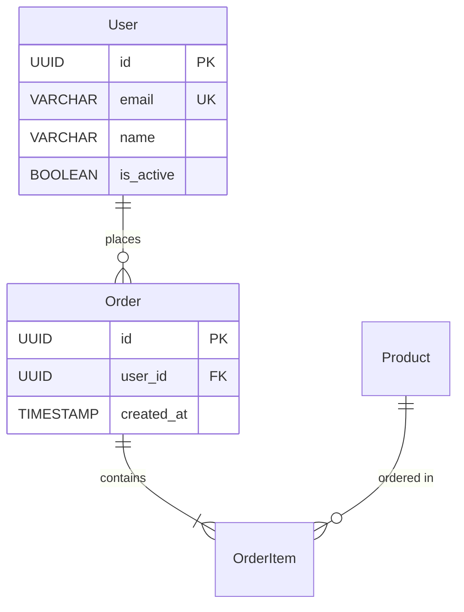

# データベース設計書作成ガイドライン

**バージョン**: v1.1.0
**最終更新**: 2026-02-04
**目的**: データベース設計書の記載粒度、ルール、原則を定義

---

## 目次

1. [ガイドラインの目的](#ガイドラインの目的)
2. [記載粒度](#記載粒度)
3. [記載すべき情報](#記載すべき情報)
4. [記載しない情報](#記載しない情報)
5. [命名規則](#命名規則)
6. [データ型の選択](#データ型の選択)
7. [制約とインデックス](#制約とインデックス)
8. [ビジネスルール](#ビジネスルール)
9. [ER図の記載方法](#er図の記載方法)
10. [整合性確認](#整合性確認)
11. [バージョン管理](#バージョン管理)

---

## ガイドラインの目的

### **このガイドラインが解決する問題**

1. **ドキュメントの肥大化防止**
   - 実装コードを記載しない
   - 実装ツール（Prisma、TypeORM等）に依存しない
   - 設計に必要な情報のみを記載

2. **保守性の向上**
   - 一貫した記載方法
   - 明確な情報の役割分担
   - 変更時の影響範囲を最小化

3. **AI駆動開発の効率化**
   - 明確な記載粒度
   - テンプレートとの連携
   - 自動生成しやすい構造

---

## 記載粒度

### **適切な記載粒度**

#### **✅ 記載すべきレベル**

**テーブル定義**:
```markdown
## User（ユーザー）

### テーブル定義

| カラム名 | データ型 | NULL | デフォルト | 説明 |
|---------|---------|------|-----------|------|
| id | UUID | NOT NULL | uuid_generate_v4() | 主キー |
| email | VARCHAR(255) | NOT NULL | - | メールアドレス |
| name | VARCHAR(100) | NOT NULL | - | ユーザー名 |
| is_active | BOOLEAN | NOT NULL | true | 有効フラグ |
| created_at | TIMESTAMP | NOT NULL | CURRENT_TIMESTAMP | 作成日時 |
```

**制約**:
```markdown
### 制約

- **PRIMARY KEY**: `id`
- **UNIQUE**: `email`
- **CHECK**: `email ~* '^[A-Za-z0-9._%+-]+@[A-Za-z0-9.-]+\.[A-Z|a-z]{2,}$'`
```

**ビジネスルール**:
```markdown
### ビジネスルール

1. メールアドレスは一意
2. 論理削除を使用（`deleted_at`）
3. パスワードはハッシュ化して保存（別テーブル）
```

---

#### **❌ 過剰な記載（避けるべき）**

**実装コード**:
```markdown
❌ 避ける

### Prismaスキーマ
```prisma
model User {
  id String @id @default(uuid())
  email String @unique
}
```

**理由**: 実装ツールは開発者が選択するため、設計書に記載しない
```

**SQL文**:
```markdown
❌ 避ける

### テーブル作成SQL
```sql
CREATE TABLE users (
  id UUID PRIMARY KEY DEFAULT uuid_generate_v4(),
  email VARCHAR(255) NOT NULL UNIQUE
);
```

**理由**: SQLは実装段階で生成するため、設計書に記載しない
```

---

#### **不足している記載（追加すべき）**

**ビジネスルールが不明**:
```markdown
[要確認 / To be confirmed]

## User（ユーザー）

| カラム名 | データ型 |
|---------|---------|
| id | UUID |
| email | VARCHAR(255) |

→ ビジネスルール、制約、インデックスが不明
```

**リレーションが不明**:
```markdown
[要確認 / To be confirmed]

## Order（注文）

| カラム名 | データ型 |
|---------|---------|
| id | UUID |
| user_id | UUID |

→ user_id が何を参照するか不明
```

---

## 記載すべき情報

### **必須情報**

| 情報 | 記載場所 | 例 |
|------|---------|-----|
| **テーブル名** | 各テーブル設計書 | `User`, `Order`, `OrderItem` |
| **テーブル概要** | 各テーブル設計書 | 「ユーザーの基本情報を管理」 |
| **カラム定義** | 各テーブル設計書 | カラム名、データ型、NULL、デフォルト、説明 |
| **制約** | 各テーブル設計書 | PRIMARY KEY, FOREIGN KEY, UNIQUE, CHECK |
| **インデックス** | 各テーブル設計書 | 検索性能向上のためのインデックス |
| **リレーション** | 各テーブル設計書 + ER図 | 1:N, N:1, N:M |
| **ビジネスルール** | 各テーブル設計書 | 論理削除、ステータス遷移、バリデーション |
| **ER図** | `05_ER_Diagram.md` | Mermaid形式 |

---

### **推奨情報**

| 情報 | 記載場所 | 例 |
|------|---------|-----|
| **パフォーマンス考慮** | 各テーブル設計書 | インデックス戦略、パーティショニング |
| **セキュリティ考慮** | 各テーブル設計書 | 個人情報、暗号化 |
| **データ保持期間** | 各テーブル設計書 | ログは1年、トランザクションは永続 |
| **想定データ量** | 各テーブル設計書 | 初年度10万件、年間成長率20% |

---

## 記載しない情報

### **実装段階で決定する情報**

| 情報 | 理由 |
|------|------|
| **Prismaスキーマ** | 実装ツールは開発者が選択 |
| **TypeORM Entity** | 実装ツールは開発者が選択 |
| **SQL文** | 実装段階で生成 |
| **マイグレーションツール** | 実装段階で選択 |
| **ORM固有の設定** | 実装ツールに依存 |

---

### **他のドキュメントに記載する情報**

| 情報 | 記載場所 |
|------|---------|
| **画面レイアウト** | 画面設計書 |
| **API仕様** | API設計書 |
| **ビジネスロジック** | 詳細設計書 |
| **テストケース** | テスト仕様書 |

---

## 命名規則

### **テーブル名**

- **形式**: パスカルケース（PascalCase）
- **単数形**: `User`, `Order`, `OrderItem`
- **英語**: 日本語は使用しない

**例**:
- ✅ `User`, `Warehouse`, `ASN`, `InboundReceipt`
- ❌ `users`, `倉庫`, `asn_table`

---

### **カラム名**

- **形式**: スネークケース（snake_case）
- **英語**: 日本語は使用しない
- **予約語を避ける**: `order` → `order_id`

**例**:
- ✅ `user_id`, `created_at`, `is_active`
- ❌ `userId`, `CreatedAt`, `作成日時`

---

### **制約名**

- **PRIMARY KEY**: `pk_[table_name]`
- **FOREIGN KEY**: `fk_[table_name]_[column_name]`
- **UNIQUE**: `uq_[table_name]_[column_name]`
- **CHECK**: `ck_[table_name]_[column_name]`

**例**:
- `pk_user`
- `fk_order_user_id`
- `uq_user_email`
- `ck_user_email_format`

---

### **インデックス名**

- **形式**: `idx_[table_name]_[column_name]`
- **複合インデックス**: `idx_[table_name]_[column1]_[column2]`

**例**:
- `idx_user_email`
- `idx_order_user_id_created_at`

---

## データ型の選択

### **PostgreSQL標準型を使用**

| 用途 | データ型 | 例 |
|------|---------|-----|
| **主キー** | UUID | `id UUID` |
| **文字列（短）** | VARCHAR(n) | `code VARCHAR(10)` |
| **文字列（長）** | TEXT | `notes TEXT` |
| **整数** | INTEGER | `quantity INTEGER` |
| **小数** | NUMERIC(p, s) | `price NUMERIC(10, 2)` |
| **真偽値** | BOOLEAN | `is_active BOOLEAN` |
| **日付** | DATE | `expected_date DATE` |
| **日時** | TIMESTAMP | `created_at TIMESTAMP` |
| **JSON** | JSONB | `metadata JSONB` |

---

### **データ型選択の原則**

1. **UUID vs INTEGER**
   - ✅ UUID: 分散システム、セキュリティ重視
   - ※ INTEGER: パフォーマンス重視、単一データベース

2. **VARCHAR vs TEXT**
   - ✅ VARCHAR(n): 長さ制限がある場合
   - ✅ TEXT: 長さ制限がない場合

3. **NUMERIC vs FLOAT**
   - ✅ NUMERIC: 金額、正確な計算が必要
   - ※ FLOAT: 科学計算、近似値でOK

4. **TIMESTAMP vs TIMESTAMPTZ**
   - ✅ TIMESTAMPTZ: タイムゾーン考慮（推奨）
   - ※ TIMESTAMP: タイムゾーン不要

---

## 制約とインデックス

### **制約の種類**

| 制約 | 用途 | 例 |
|------|------|-----|
| **PRIMARY KEY** | 主キー | `id UUID PRIMARY KEY` |
| **FOREIGN KEY** | 外部キー | `user_id UUID REFERENCES User(id)` |
| **UNIQUE** | 一意制約 | `email VARCHAR(255) UNIQUE` |
| **NOT NULL** | NULL禁止 | `name VARCHAR(100) NOT NULL` |
| **CHECK** | 値の範囲制限 | `CHECK (quantity >= 0)` |
| **DEFAULT** | デフォルト値 | `is_active BOOLEAN DEFAULT true` |

---

### **インデックスの設計**

#### **インデックスを作成すべきケース**

1. **検索条件に使用するカラム**
   - `WHERE user_id = ?` → `idx_order_user_id`

2. **ソートに使用するカラム**
   - `ORDER BY created_at DESC` → `idx_order_created_at`

3. **外部キー**
   - `FOREIGN KEY (user_id)` → `idx_order_user_id`

4. **複合検索**
   - `WHERE user_id = ? AND status = ?` → `idx_order_user_id_status`

---

#### **インデックスを作成しないケース**

1. **小さなテーブル**（1000件未満）
2. **更新頻度が高いカラム**
3. **カーディナリティが低いカラム**（例: `is_active`）

---

## ビジネスルール

### **記載すべきビジネスルール**

1. **論理削除**
   - `deleted_at IS NULL` で有効なレコードを判定

2. **ステータス遷移**
   - `Draft → Submitted → Confirmed → Completed`

3. **バリデーション**
   - メールアドレス形式、電話番号形式

4. **自動採番**
   - `ASN-YYYYMMDD-XXXX`

5. **データ保持期間**
   - ログは1年、トランザクションは永続

---

### **記載例**

```markdown
### ビジネスルール

1. **論理削除**: `deleted_at IS NULL` で有効なレコードを判定
2. **ステータス遷移**: `Draft → Submitted → Confirmed → Completed → Cancelled`
3. **ASN番号**: 自動採番（`ASN-YYYYMMDD-XXXX`）
4. **入庫予定日**: 未来の日付のみ許可
5. **承認ワークフロー**: `Submitted` 状態で承認待ち
```

---

## ER図の記載方法

### **Mermaid形式を使用**



---

### **ER図の記載ルール**

1. **リレーション表記**
   - `||--o{`: 1対多
   - `||--||`: 1対1
   - `}o--o{`: 多対多

2. **主キー**: `PK`
3. **外部キー**: `FK`
4. **一意制約**: `UK`

---

## 整合性確認

### **チェックリスト**

- [ ] すべてのテーブルに主キーが定義されている
- [ ] すべての外部キーに対応するインデックスが定義されている
- [ ] すべてのカラムにNULL制約が明示されている
- [ ] すべてのテーブルに`created_at`, `updated_at`が定義されている
- [ ] 論理削除を使用する場合、`deleted_at`が定義されている
- [ ] ER図とテーブル定義が一致している
- [ ] ビジネスルールが明確に記載されている

---

## バージョン管理

### **バージョン番号**

- **形式**: `vX.Y.Z`
- **X**: メジャーバージョン（破壊的変更）
- **Y**: マイナーバージョン（機能追加）
- **Z**: パッチバージョン（バグ修正）

### **変更履歴**

各設計書の末尾に変更履歴を記載:

```markdown
## 変更履歴

| バージョン | 日付 | 変更内容 |
|-----------|------|---------|
| v1.0.0 | 2025-12-30 | 初版作成 |
| v1.1.0 | 2025-12-31 | ASNテーブル追加 |
```

---

**作成者**: [Your Team Name]
**最終更新**: 2026-02-04

