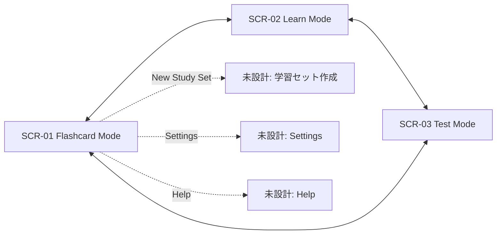

# 01 画面一覧・遷移図

**作成日**: 2026-07-09
**バージョン**: v1.0.0
**準拠モックアップ**: `flashcard_mode_*`, `learn_mode_*`, `test_mode_*`（本リポジトリのStitch生成モックアップ）
**参照要件**: `../01_Business_Process/requirements/StudyFlow_Requirements.md`

---

## 画面一覧

| 画面ID | 画面名 | URL | モックアップ | 対応デバイス | Phase |
|--------|--------|-----|-------------|-------------|-------|
| SCR-01 | Flashcard Mode | `/study/:setId/flashcards` | `flashcard_mode_desktop_centered/code.html`, `flashcard_mode_mobile/code.html` | PC / モバイル | Phase 1 |
| SCR-02 | Learn Mode | `/study/:setId/learn` | `learn_mode_desktop_centered/code.html`, `learn_mode_mobile/code.html` | PC / モバイル | Phase 1 |
| SCR-03 | Test Mode | `/study/:setId/test` | `test_mode_desktop_centered/code.html`, `test_mode_mobile/code.html` | PC / モバイル | Phase 1 |

**[要確認]** 以下の遷移先はモックアップが存在しないため、画面IDは未採番:
- New Study Set（学習セット作成）
- Settings
- Help
- 通知一覧 / 検索結果

---

## 画面遷移図

**遷移条件**:
- SCR-01 / SCR-02 / SCR-03 間の遷移は、共通ナビゲーション（サイドバー / ボトムタブバー）のタブクリックによる（`StudyFlow_Requirements.md` F-004）。
- 各画面は同一の学習セット（`:setId`）コンテキストを保持したまま遷移する。[要確認] 学習セット未選択時の初期遷移元（一覧画面等）は本リポジトリのスコープ外。

---

**作成者**: [Your Team Name]
**最終更新**: 2026-07-09
