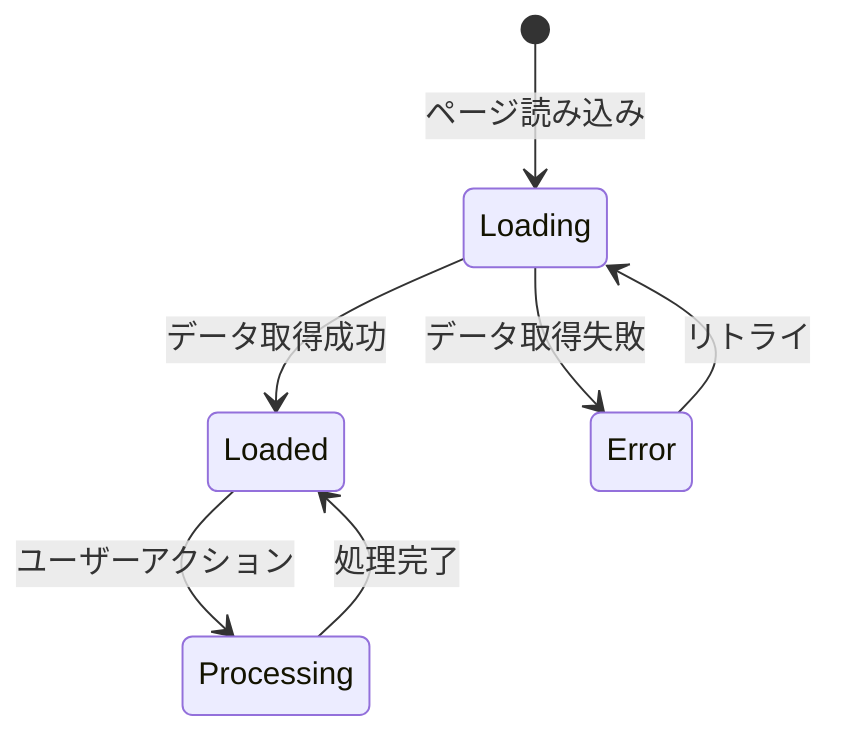
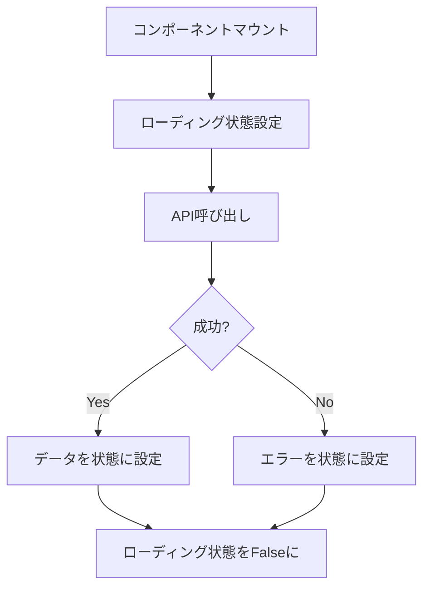
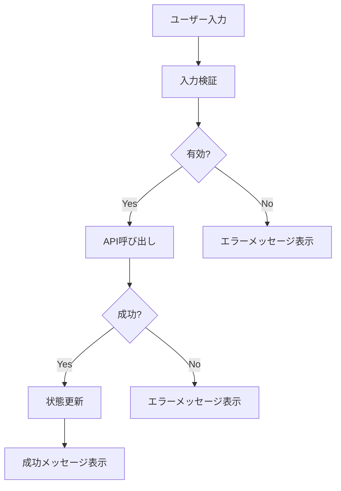
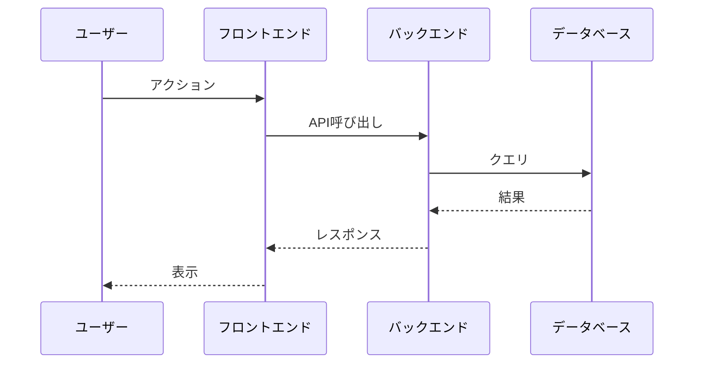

# [機能名] 詳細設計書

**プロジェクト**: [Your Project Name]
**対象機能**: [機能名]（例: プロジェクト管理、タスク管理、ユーザー管理）
**Phase**: Phase 1 / Phase 2
**作成日**: YYYY-MM-DD
**最終更新**: YYYY-MM-DD

---

## 目次

1. [概要](#概要)
2. [コンポーネント構成](#コンポーネント構成)
3. [状態管理](#状態管理)
4. [イベントハンドラ](#イベントハンドラ)
5. [ビジネスロジック](#ビジネスロジック)
6. [データフロー](#データフロー)
7. [シーケンス図](#シーケンス図)
8. [データベーストランザクション](#データベーストランザクション)
9. [エラーハンドリング](#エラーハンドリング)
10. [パフォーマンス要件](#パフォーマンス要件)
11. [セキュリティ要件](#セキュリティ要件)
12. [関連ドキュメント](#関連ドキュメント)

---

## 概要

### **機能概要**
[機能の概要を記述]

### **Phase 1実装範囲**
- [機能1]
- [機能2]

### **Phase 2実装範囲**
- [機能1]
- [機能2]

### **業務フロー上の位置づけ**
[業務フロー全体の中でのこの機能の位置づけを記述]

---

## コンポーネント構成

### **技術スタック**

**参照**: `02_Technical_Design/07_Tech_Stack_Common_Specs.md`

### **共通コンポーネント**

**参照**: `02_Technical_Design/07_Tech_Stack_Common_Specs.md` - 「共通コンポーネント」

### **画面固有コンポーネント**

| コンポーネント名 | パス | 用途 | Props |
|----------------|------|------|-------|
| [コンポーネント名] | `views/[画面名]/[コンポーネント名].vue` | [用途] | `prop1: Type`, `prop2: Type` |

### **コンポーネント階層**

```
[画面名].vue
├── Header.vue（共通）
├── Sidebar.vue（共通）
└── [画面固有コンポーネント].vue
    └── DataTable.vue（共通）
```

---

## 状態管理

### **ローカル状態**

| 変数名 | 型 | 初期値 | 説明 |
|--------|-----|--------|------|
| `data` | `DataType[]` | `[]` | [説明] |
| `isLoading` | `boolean` | `false` | ローディング状態 |
| `error` | `string \| null` | `null` | エラーメッセージ |

### **グローバル状態（Pinia Store）**

| ストア名 | 状態名 | 型 | 説明 |
|---------|--------|-----|------|
| `authStore` | `user` | `User` | ログインユーザー情報 |
| `authStore` | `token` | `string` | JWTトークン |

### **状態遷移図**



---

## イベントハンドラ

### **イベント一覧**

| イベント | ハンドラ名 | 処理内容 |
|---------|-----------|---------|
| ボタンクリック | `handleClick()` | [処理内容] |
| テーブルヘッダークリック | `handleSort(column)` | ソート処理 |
| 行クリック | `handleRowClick(id)` | 詳細画面へ遷移 |

### **処理フロー**

#### **handleSort(column: string)**

**フロー**:
1. ソート設定を更新
   - 同じ列の場合: 昇順/降順を切り替え
   - 異なる列の場合: 昇順に設定
2. ローディング状態を `true` に設定
3. API呼び出し（`GET /api/v1/[resource]`）
   - パラメータ: `sort_by`, `sort_order`
4. レスポンスデータを状態に設定
5. エラー時: コンソールにログ出力
6. ローディング状態を `false` に設定

**注**: 実装コードは `views/[画面名]/[コンポーネント名].vue` を参照

---

## ビジネスロジック

### **計算ロジック**

#### **進捗率の計算**
- **計算式**: `(実績数 / 予定数) × 100`（小数点以下四捨五入）
- **予定数が0の場合**: `0%` を返す

#### **遅延判定**
- **条件**: 以下の両方を満たす場合、遅延と判定
  1. バンニング日まで3日以内
  2. 進捗率が50%未満

### **バリデーションルール**

| 項目 | ルール | エラーメッセージ |
|------|--------|----------------|
| 案件コード | 必須、YYMXX形式、5文字固定 | 「案件コードはYYMXX形式で入力してください」 |
| バンニング日 | 必須、YYYY-MM-DD形式、未来日のみ | 「バンニング日は未来日を指定してください」 |

### **ビジネスロジックバリデーション**

| 項目 | ルール | エラーメッセージ |
|------|--------|----------------|
| 入庫予定数 | 入庫予定数 ≧ 入庫依頼数 | 「入庫予定数は入庫依頼数以上である必要があります」 |
| 出庫予定数 | 出庫予定数 ≧ 出庫依頼数 | 「出庫予定数は出庫依頼数以上である必要があります」 |

**注**: 実装コードは `utils/business-logic.ts` を参照

---

## データフロー

### **データ取得フロー**



### **データ更新フロー**



---

## シーケンス図

### **メインシーケンス**



---

## データベーストランザクション

### **トランザクション範囲**

#### **[トランザクション名]**

**範囲**:
```
BEGIN;
  -- 主要な操作
  [操作1]
  [操作2]
COMMIT;
```

**使用テーブル**:
- `table1`: [用途]
- `table2`: [用途]

**ロールバック条件**:
- [条件1]
- [条件2]

**注**: 詳細なSQLは実装コードを参照

---

## エラーハンドリング

### **APIエラー**

| エラーコード | エラーメッセージ | ユーザーメッセージ | アクション |
|------------|----------------|------------------|-----------|
| 400 | Bad Request | 「入力内容が不正です」 | バリデーションエラー表示 |
| 401 | Unauthorized | 「再度ログインしてください」 | ログイン画面へリダイレクト |
| 404 | Not Found | 「データが見つかりません」 | エラーメッセージ表示 |
| 500 | Internal Server Error | 「サーバーエラーが発生しました」 | エラーメッセージ表示 |
| Timeout | Request Timeout | 「通信タイムアウトしました」 | リトライボタン表示 |

### **表示方法**
- トースト通知（右上、3秒表示）
- 入力フィールド下にエラーメッセージ（バリデーションエラー）

### **エラーログ**
- コンソールログ（開発環境）
- エラートラッキングサービス（本番環境）

---

## パフォーマンス要件

### **応答時間**

| 項目 | 目標値 | 測定結果 | 状況 |
|------|--------|---------|------|
| 初期表示 | 2秒以内 | - | 未実施 |
| APIレスポンス | 1秒以内 | - | 未実施 |
| テーブルソート | 100ms以内 | - | 未実施 |

### **スループット**

| 項目 | 目標値 | 測定結果 | 状況 |
|------|--------|---------|------|
| 同時接続数 | 100ユーザー | - | 未実施 |
| データ件数 | 1,000件 | - | 未実施 |

### **最適化戦略**
- APIレスポンスのキャッシュ
- ページネーション（100件/ページ）
- 遅延ロード

---

## セキュリティ要件

### **認証**
- JWTトークン認証
- トークン有効期限: 24時間
- リフレッシュトークン: 7日間

### **認可**
- ロールベースアクセス制御（RBAC）
- API毎の権限チェック

### **データ保護**
- パスワードハッシュ化（bcrypt）
- 機密データの暗号化
- SQLインジェクション対策（パラメータ化クエリ）

### **XSS/CSRF対策**
- 入力サニタイズ
- CSRFトークン検証
- Content Security Policy（CSP）

**参照**: `02_Technical_Design/05_セキュリティ設計書.md`

---

## 関連ドキュメント

### **画面設計書**
- `04_UI_UX_Design/screen_design/XX_[画面名].md`

### **API設計書**
- `05_API_Design/XX_[機能名]_API.md`

### **テスト仕様書**
- `07_Test_Design/XX_[機能名]_Test_Spec.md`

### **データベース設計書**
- `../03_Database_Design/` - テーブル設計書

---

## 更新履歴

| 日付 | バージョン | 変更内容 |
|------|-----------|---------|
| YYYY-MM-DD | v1.0.0 | 初版作成 |

---

**作成者**: [Your Team Name]
**最終更新**: YYYY-MM-DD

