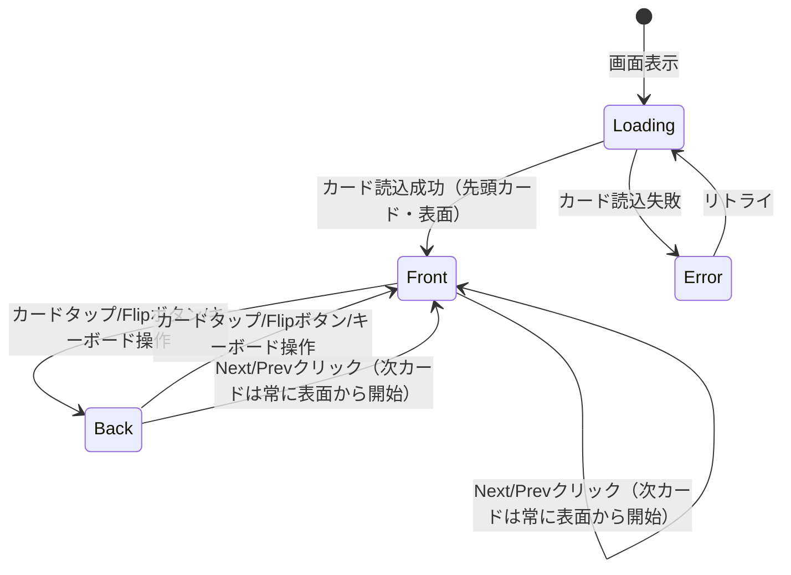
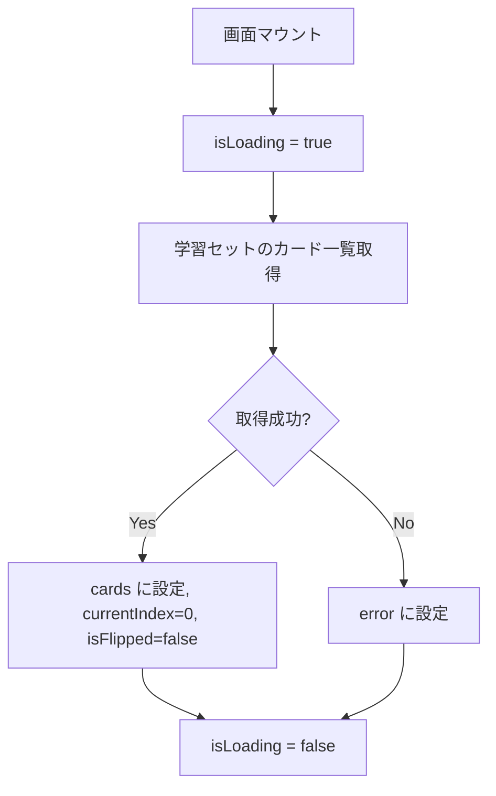
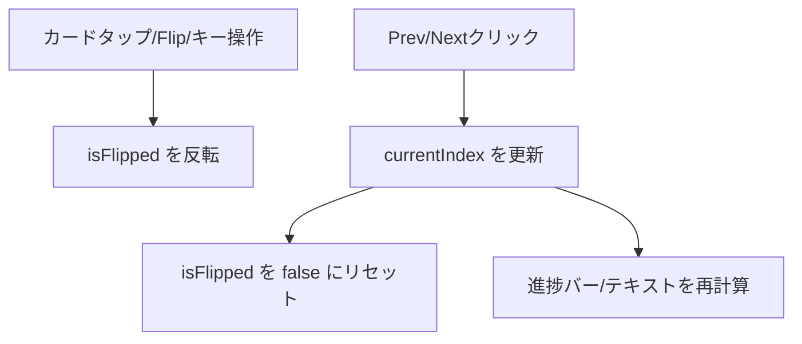
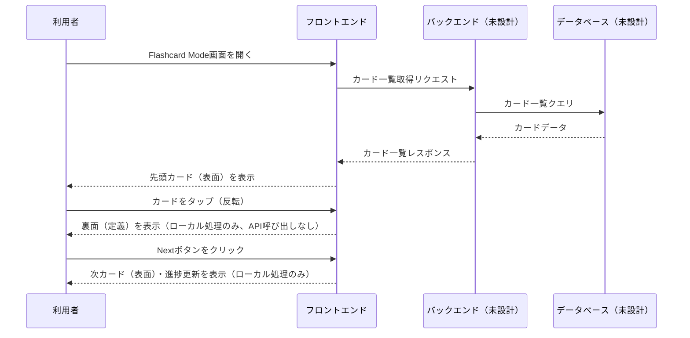

# Flashcard Mode 詳細設計書

**プロジェクト**: StudyFlow (Lumina Study)
**対象機能**: Flashcard Mode（SCR-01）
**Phase**: Phase 1
**作成日**: 2026-07-09
**最終更新**: 2026-07-09

---

## 目次

1. [概要](#概要)
2. [コンポーネント構成](#コンポーネント構成)
3. [状態管理](#状態管理)
4. [イベントハンドラ](#イベントハンドラ)
5. [ビジネスロジック](#ビジネスロジック)
6. [データフロー](#データフロー)
7. [シーケンス図](#シーケンス図)
8. [データベーストランザクション](#データベーストランザクション)
9. [エラーハンドリング](#エラーハンドリング)
10. [パフォーマンス要件](#パフォーマンス要件)
11. [セキュリティ要件](#セキュリティ要件)
12. [関連ドキュメント](#関連ドキュメント)

---

## 概要

### **機能概要**
学習セットに含まれる用語カードを1枚ずつ表示し、タップ/クリックで表面（用語）と裏面（定義）を反転させながら暗記学習を行う機能。カード送り（Prev/Next）と学習進捗表示を含む。

### **Phase 1実装範囲**
- カード表面/裏面の反転表示
- Prev/Next によるカード送り
- 進捗（現在カード番号/総カード数、達成率%）表示
- （PC）キーボード操作によるカード反転

### **Phase 2実装範囲**
- 学習セット作成・編集との連携
- 習熟度に基づくカードの並べ替え・スキップ（[要確認] 要件未確定）

### **業務フロー上の位置づけ**
Flashcard / Learn / Test の3学習モードのうち、最も基本的な「読んで覚える」学習フロー。学習セットを開いた際の起点画面として利用されることを想定（[要確認] 学習セット選択後の初期表示モードは未定義）。

---

## コンポーネント構成

### **技術スタック**

[要確認] 本プロジェクトのフロントエンド実装技術（フレームワーク）は未確定。`02_Technical_Design/01_Tech_Stack_Common_Specs.md` はサンプルとして Vue.js/Quasar を記載しているが、確定情報ではない。以下のコンポーネント名は、既存モックアップ（`flashcard_mode_desktop_centered/code.html`, `flashcard_mode_mobile/code.html`）のDOM構造を基にした論理的な単位であり、採用フレームワーク確定後に読み替えること。

### **共通コンポーネント**

| コンポーネント名 | 用途 |
|----------------|------|
| AppSidebar | PC用サイドナビゲーション（Flashcards/Learn/Test切替、New Study Set、Settings、Help） |
| AppTopBar | モバイル用上部バー（ロゴ、通知、検索） |
| AppBottomTabBar | モバイル用下部タブバー（Flashcards/Learn/Test切替） |
| ProgressBar | 進捗バー（Learn/Test Modeと共通） |

### **画面固有コンポーネント**

| コンポーネント名 | 用途 | Props |
|----------------|------|-------|
| FlashcardViewer | カード本体の表示・反転アニメーション制御 | `term: string`, `definition: string`, `isFlipped: boolean` |
| FlashcardControls | Prev/Next/Flip ボタン群 | `onPrev: () => void`, `onNext: () => void`, `onFlip: () => void`, `disablePrev: boolean`, `disableNext: boolean` |
| StudySetHeader | セット名・分類タグ・オプションメニューの表示 | `title: string`, `tags: string[]` |

### **コンポーネント階層**

```
FlashcardModePage
├── AppSidebar（PC） / AppTopBar + AppBottomTabBar（モバイル）
├── StudySetHeader
├── ProgressBar
├── FlashcardViewer
└── FlashcardControls
```

---

## 状態管理

### **ローカル状態**

| 変数名 | 型 | 初期値 | 説明 |
|--------|-----|--------|------|
| `cards` | `FlashcardItem[]` | `[]` | 学習セットのカード一覧（[要確認] データ取得元未確定） |
| `currentIndex` | `number` | `0` | 現在表示中のカードのインデックス |
| `isFlipped` | `boolean` | `false` | 現在のカードが裏面表示中かどうか |
| `isLoading` | `boolean` | `false` | カード一覧の読込中状態 |
| `error` | `string \| null` | `null` | エラーメッセージ |

### **グローバル状態（将来のStore想定）**

[要確認] 現時点でグローバル状態管理ライブラリは未確定。学習セットIDやユーザー情報など画面間で共有が必要な状態が発生する場合は、確定後に定義する。

### **状態遷移図**



---

## イベントハンドラ

### **イベント一覧**

| イベント | ハンドラ名 | 処理内容 |
|---------|-----------|---------|
| カードクリック/タップ | `handleFlipCard()` | カードの表裏を反転 |
| Flipボタンクリック | `handleFlipCard()` | 同上（カードクリックと同一処理） |
| キーボード操作（PC） | `handleKeyDown(event)` | Space / ArrowUp / ArrowDown で `handleFlipCard()` を実行 |
| Prevボタンクリック | `handlePrev()` | 前のカードに移動 |
| Nextボタンクリック | `handleNext()` | 次のカードに移動 |

### **処理フロー**

#### **handleFlipCard()**

**フロー**:
1. `isFlipped` を反転（`true` ⇔ `false`）
2. 反転アニメーションを実行

**注**: 実装コードは `FlashcardViewer` コンポーネントを参照

#### **handlePrev()**

**フロー**:
1. `currentIndex` が `0` の場合は何もしない（[要確認] 先頭カードでの挙動は未定義、暫定的に無操作とする）
2. `currentIndex` を `-1`
3. `isFlipped` を `false` にリセット（表示は常に表面から開始）
4. 進捗バー・進捗テキストを再計算（「ビジネスロジック」参照）

**注**: 実装コードは `FlashcardControls` / `FlashcardModePage` を参照

#### **handleNext()**

**フロー**:
1. `currentIndex` が `cards.length - 1`（最終カード）の場合は何もしない（[要確認] 最終カード到達時の挙動、例: 完了画面表示は未定義）
2. `currentIndex` を `+1`
3. `isFlipped` を `false` にリセット
4. 進捗バー・進捗テキストを再計算

**注**: 実装コードは `FlashcardControls` / `FlashcardModePage` を参照

---

## ビジネスロジック

### **進捗率の計算**
- **計算式**: `(currentIndex + 1) ÷ cards.length × 100`（小数点以下四捨五入）
- **`cards.length` が0の場合**: `0%` を返す（[要確認] 空の学習セットの表示仕様は未定義）

### **バリデーションルール**

該当なし（本画面はユーザー入力を受け付けない、選択操作のみ）。

---

## データフロー

### **データ取得フロー**



**注**: 取得元（API / ローカルデータ）は [要確認] データベース・API設計が未着手のため未確定。

### **カード送り・反転フロー**



---

## シーケンス図

### **メインシーケンス（将来のAPI接続を想定した仮設計）**

[要確認] 現状バックエンド・APIは未設計のため、下図は将来像の仮設計であり確定仕様ではない。



---

## データベーストランザクション

該当なし。Phase 1では画面表示のみで、データの登録・更新・削除を行わない。[要確認] 学習履歴（既読カード、習熟度等）を保存する場合は、DB設計フェーズで別途トランザクション設計が必要。

---

## エラーハンドリング

### **APIエラー**（将来のAPI接続時、[要確認] 確定仕様ではない）

| エラーコード | エラーメッセージ | ユーザーメッセージ | アクション |
|------------|----------------|------------------|-----------|
| 404 | Not Found | 「学習セットが見つかりません」 | エラーメッセージ表示 |
| 500 | Internal Server Error | 「サーバーエラーが発生しました」 | エラーメッセージ表示 |
| Timeout | Request Timeout | 「通信タイムアウトしました」 | リトライボタン表示 |

### **表示方法**
- 画面中央にエラーメッセージ表示（モックアップ上、エラー表示UIは未実装のため要デザイン検討 [要確認]）

### **エラーログ**
- コンソールログ（開発環境）

---

## パフォーマンス要件

### **応答時間**

| 項目 | 目標値 | 測定結果 | 状況 |
|------|--------|---------|------|
| カード反転アニメーション | 0.6秒 | - | 未実施（モックアップ実装値に基づく目安） |
| カード送り（Prev/Next） | 100ms以内 | - | 未実施 |

### **最適化戦略**
- カード一覧は学習セット単位で一括取得し、カード送りの都度APIを呼び出さない（N+1回避）。

---

## セキュリティ要件

該当なし（Phase 1は表示のみ・データ入出力なし）。[要確認] 将来バックエンド接続時は `docs/00_Project_Guidelines/00_AI_Rules.md` のセキュリティ規律に従う。

---

## 関連ドキュメント

### **画面設計書**
- `../04_Screen_Design/02_Flashcard_Mode.md`

### **API設計書**
- [要確認] 未作成

### **データベース設計書**
- [要確認] 未作成

### **要件定義書**
- `../01_Business_Process/requirements/StudyFlow_Requirements.md`（F-001）

---

## 更新履歴

| 日付 | バージョン | 変更内容 |
|------|-----------|---------|
| 2026-07-09 | v1.0.0 | 初版作成 |

---

**作成者**: Claude Code
**最終更新**: 2026-07-09
