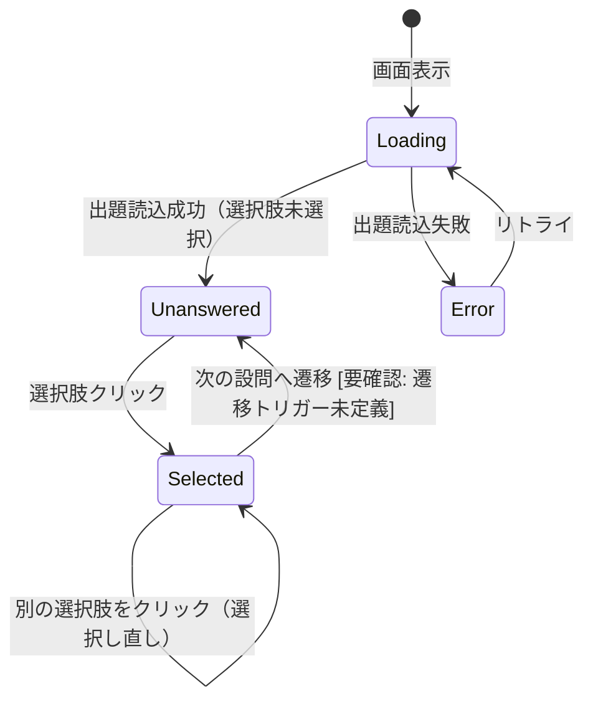
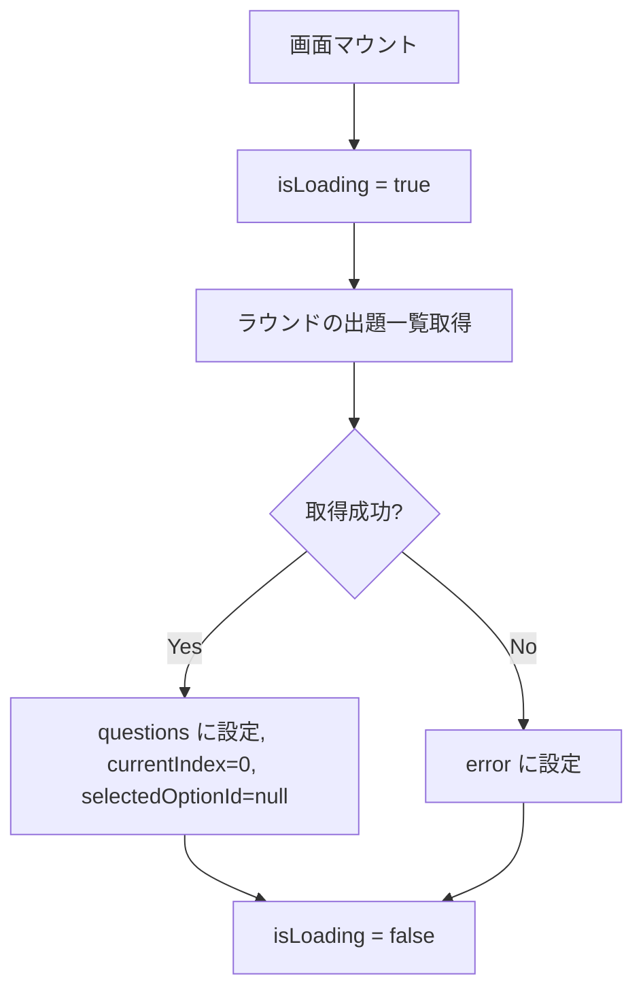
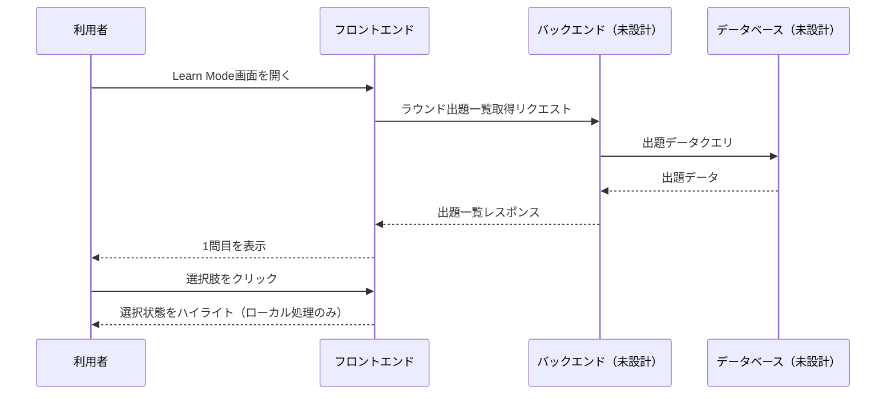

# Learn Mode 詳細設計書

**プロジェクト**: StudyFlow (Lumina Study)
**対象機能**: Learn Mode（SCR-02）
**Phase**: Phase 1
**作成日**: 2026-07-09
**最終更新**: 2026-07-09

---

## 目次

1. [概要](#概要)
2. [コンポーネント構成](#コンポーネント構成)
3. [状態管理](#状態管理)
4. [イベントハンドラ](#イベントハンドラ)
5. [ビジネスロジック](#ビジネスロジック)
6. [データフロー](#データフロー)
7. [シーケンス図](#シーケンス図)
8. [データベーストランザクション](#データベーストランザクション)
9. [エラーハンドリング](#エラーハンドリング)
10. [パフォーマンス要件](#パフォーマンス要件)
11. [セキュリティ要件](#セキュリティ要件)
12. [関連ドキュメント](#関連ドキュメント)

---

## 概要

### **機能概要**
用語の定義を出題し、4択の選択肢から正しい用語を選ぶ形式で学習を進める機能。学習は「ラウンド」単位で管理される。

### **Phase 1実装範囲**
- 出題カード・4択選択肢の表示
- 選択肢の選択・ハイライト表示
- ラウンド内の進捗表示

### **Phase 2実装範囲**
- 正誤判定・フィードバック表示
- 誤答した用語の再出題ロジック
- 「Don't know?」「Hint」「Report」の実処理（[要確認] 要件未確定）

### **業務フロー上の位置づけ**
Flashcard Mode（受動的な暗記）とTest Mode（評価）の間に位置する、能動的な確認学習フロー。ラウンドを重ねることで習熟度を高めることを想定（[要確認] ラウンド進行・完了条件の仕様は未確定）。

---

## コンポーネント構成

### **技術スタック**

[要確認] `01_Flashcard_Mode_Detailed_Design.md` の「技術スタック」注記に同じ。フロントエンド実装技術は未確定。

### **共通コンポーネント**

| コンポーネント名 | 用途 |
|----------------|------|
| AppSidebar / AppTopBar / AppBottomTabBar | 共通ナビゲーション（`01_Flashcard_Mode_Detailed_Design.md` 参照） |
| ProgressBar | 進捗バー（Flashcard/Test Modeと共通） |

### **画面固有コンポーネント**

| コンポーネント名 | 用途 | Props |
|----------------|------|-------|
| LearnQuestionCard | 出題文・出題タイプタグの表示 | `prompt: string`, `tag: string` |
| LearnOptionList | 4択選択肢の表示・選択状態管理 | `options: string[]`, `selectedId: string \| null`, `onSelect: (id: string) => void` |
| LearnAuxActions | 「Don't know?」/「Hint」/「Report」ボタン群 | `onDontKnow?: () => void`, `onHint?: () => void`, `onReport?: () => void` |

### **コンポーネント階層**

```
LearnModePage
├── AppSidebar（PC） / AppTopBar + AppBottomTabBar（モバイル）
├── ProgressBar
├── LearnQuestionCard
├── LearnOptionList
└── LearnAuxActions
```

---

## 状態管理

### **ローカル状態**

| 変数名 | 型 | 初期値 | 説明 |
|--------|-----|--------|------|
| `questions` | `LearnQuestion[]` | `[]` | ラウンドの出題一覧（[要確認] データ取得元未確定） |
| `currentIndex` | `number` | `0` | 現在の設問インデックス |
| `selectedOptionId` | `string \| null` | `null` | 現在選択中の選択肢ID |
| `roundName` | `string` | `''` | 表示中のラウンド名 |
| `isLoading` | `boolean` | `false` | 読込中状態 |
| `error` | `string \| null` | `null` | エラーメッセージ |

### **グローバル状態**

[要確認] 現時点で未確定（`01_Flashcard_Mode_Detailed_Design.md` に同じ）。

### **状態遷移図**



---

## イベントハンドラ

### **イベント一覧**

| イベント | ハンドラ名 | 処理内容 |
|---------|-----------|---------|
| 選択肢クリック/タップ | `handleSelectOption(optionId)` | 選択肢を選択状態にする |
| Don't know?クリック（PC） | `handleDontKnow()` | [要確認] 処理内容未定義 |
| Hintクリック（モバイル） | `handleHint()` | [要確認] 処理内容未定義 |
| Reportクリック（モバイル） | `handleReport()` | [要確認] 処理内容未定義 |

### **処理フロー**

#### **handleSelectOption(optionId: string)**

**フロー**:
1. `selectedOptionId` を `optionId` に更新
2. 選択中の選択肢をハイライト表示（他の選択肢のハイライトは自動解除）
3. [要確認] 正誤判定・自動遷移の有無はモックアップ上未実装。判定を行う場合の正解データの持ち方も未定義

**注**: 実装コードは `LearnOptionList` コンポーネントを参照

---

## ビジネスロジック

### **進捗率の計算**
- **計算式**: `(currentIndex + 1) ÷ questions.length × 100`（小数点以下四捨五入）
- **`questions.length` が0の場合**: `0%` を返す

### **正誤判定ロジック**

[要確認] モックアップ上、選択後の正誤判定・フィードバック表示は実装されていない。Phase 2で以下を確定する必要がある:
- 正解データの保持方法（選択肢ごとの正解フラグ 等）
- 誤答時の挙動（正解表示、再出題キューへの追加等）
- ラウンド完了条件（全問正解、1周終了等）

### **バリデーションルール**

該当なし（選択操作のみ、入力フォームなし）。

---

## データフロー

### **データ取得フロー**



**注**: 取得元は [要確認] データベース・API設計が未着手のため未確定。

### **選択肢選択フロー**

```mermaid
graph TD
    A[選択肢クリック] --> B[selectedOptionId を更新]
    B --> C[選択状態のハイライトを再描画]
    C --> D{正誤判定を行うか [要確認]}
```

---

## シーケンス図

### **メインシーケンス（将来のAPI接続を想定した仮設計）**

[要確認] バックエンド・APIは未設計のため、下図は仮設計であり確定仕様ではない。



---

## データベーストランザクション

該当なし。Phase 1では画面表示・選択操作のみで、学習結果の保存は行わない。[要確認] ラウンド完了・誤答履歴等を保存する場合は、DB設計フェーズで別途トランザクション設計が必要。

---

## エラーハンドリング

### **APIエラー**（将来のAPI接続時、[要確認] 確定仕様ではない）

| エラーコード | エラーメッセージ | ユーザーメッセージ | アクション |
|------------|----------------|------------------|-----------|
| 404 | Not Found | 「学習セットが見つかりません」 | エラーメッセージ表示 |
| 500 | Internal Server Error | 「サーバーエラーが発生しました」 | エラーメッセージ表示 |
| Timeout | Request Timeout | 「通信タイムアウトしました」 | リトライボタン表示 |

### **表示方法**
- 画面中央にエラーメッセージ表示（[要確認] デザイン未確定）

### **エラーログ**
- コンソールログ（開発環境）

---

## パフォーマンス要件

### **応答時間**

| 項目 | 目標値 | 測定結果 | 状況 |
|------|--------|---------|------|
| 選択肢ハイライト反映 | 100ms以内 | - | 未実施 |
| 初期表示 | 2秒以内 | - | 未実施 |

### **最適化戦略**
- ラウンドの出題一覧は一括取得し、設問ごとにAPIを呼び出さない（N+1回避）。

---

## セキュリティ要件

該当なし（Phase 1は表示・選択操作のみ）。[要確認] 将来バックエンド接続時は `docs/00_Project_Guidelines/00_AI_Rules.md` のセキュリティ規律に従う。

---

## 関連ドキュメント

### **画面設計書**
- `../04_Screen_Design/03_Learn_Mode.md`

### **API設計書**
- [要確認] 未作成

### **データベース設計書**
- [要確認] 未作成

### **要件定義書**
- `../01_Business_Process/requirements/StudyFlow_Requirements.md`（F-002）

---

## 更新履歴

| 日付 | バージョン | 変更内容 |
|------|-----------|---------|
| 2026-07-09 | v1.0.0 | 初版作成 |

---

**作成者**: Claude Code
**最終更新**: 2026-07-09
