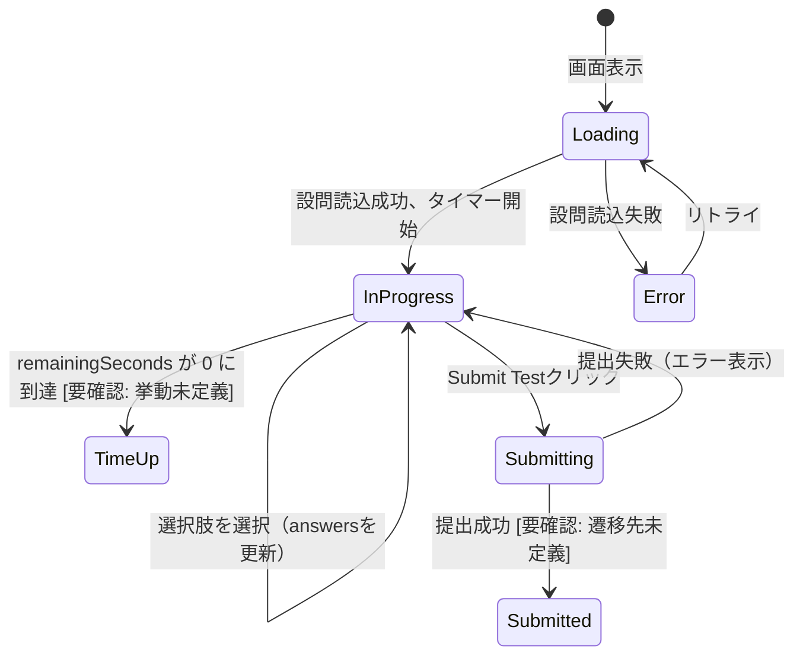
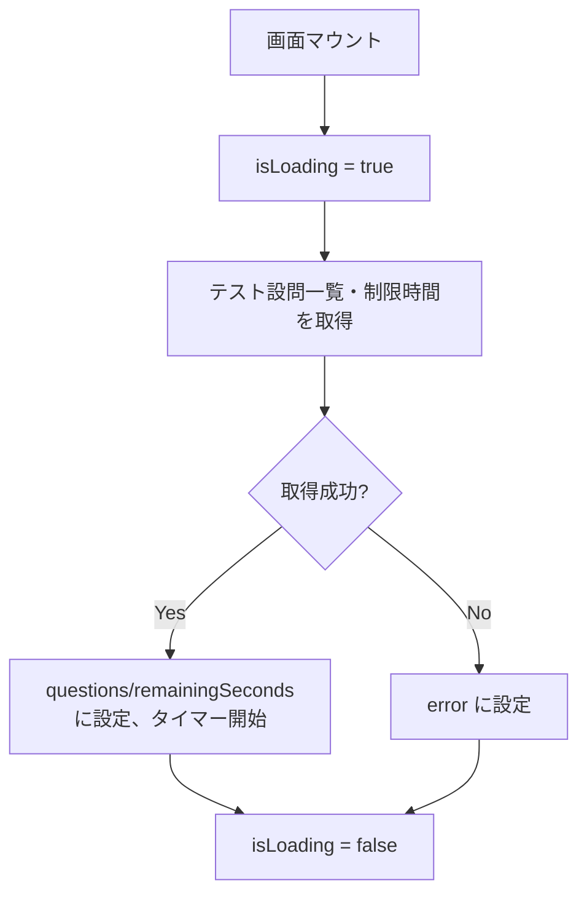
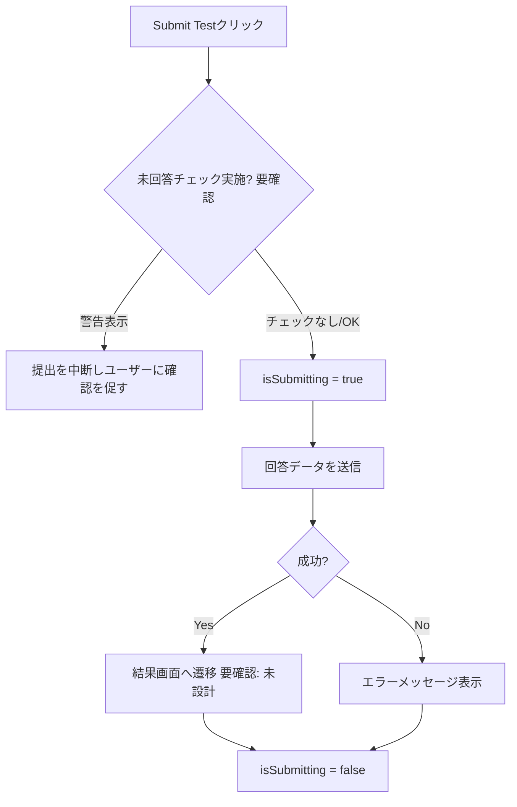
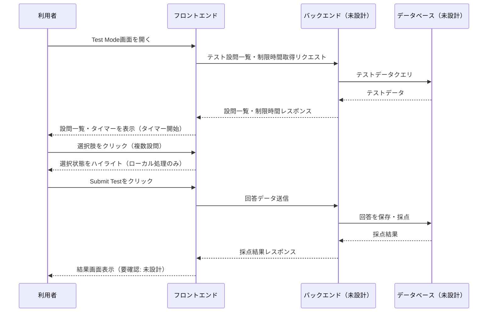

# Test Mode 詳細設計書

**プロジェクト**: StudyFlow (Lumina Study)
**対象機能**: Test Mode（SCR-03）
**Phase**: Phase 1
**作成日**: 2026-07-09
**最終更新**: 2026-07-09

---

## 目次

1. [概要](#概要)
2. [コンポーネント構成](#コンポーネント構成)
3. [状態管理](#状態管理)
4. [イベントハンドラ](#イベントハンドラ)
5. [ビジネスロジック](#ビジネスロジック)
6. [データフロー](#データフロー)
7. [シーケンス図](#シーケンス図)
8. [データベーストランザクション](#データベーストランザクション)
9. [エラーハンドリング](#エラーハンドリング)
10. [パフォーマンス要件](#パフォーマンス要件)
11. [セキュリティ要件](#セキュリティ要件)
12. [関連ドキュメント](#関連ドキュメント)

---

## 概要

### **機能概要**
制限時間内に複数の設問（Multiple Choice、True/False）へ回答し、最後に一括で提出・採点するテスト形式の学習機能。

### **Phase 1実装範囲**
- テスト名・カウントダウンタイマーの表示
- 設問カード（タイプタグ、設問文、選択肢）の表示・選択
- 進捗表示（設問番号 / 総設問数、完了率%）
- テスト提出（Submit Test）

### **Phase 2実装範囲**
- 採点・結果表示
- タイマー0到達時の自動提出
- 未回答設問がある場合の提出前警告（[要確認] 要件未確定）

### **業務フロー上の位置づけ**
Flashcard / Learn を経て習熟度を評価する、3モードの中で最も評価的な位置づけの学習フロー。[要確認] Test Mode単独での利用（事前学習なしでの受験）を許可するかは未確定。

---

## コンポーネント構成

### **技術スタック**

[要確認] `01_Flashcard_Mode_Detailed_Design.md` の「技術スタック」注記に同じ。フロントエンド実装技術は未確定。

### **共通コンポーネント**

| コンポーネント名 | 用途 |
|----------------|------|
| AppSidebar / AppTopBar / AppBottomTabBar | 共通ナビゲーション（`01_Flashcard_Mode_Detailed_Design.md` 参照） |
| ProgressBar | 進捗バー（Flashcard/Learn Modeと共通） |

### **画面固有コンポーネント**

| コンポーネント名 | 用途 | Props |
|----------------|------|-------|
| TestTimer | 残り時間のカウントダウン表示 | `remainingSeconds: number` |
| TestQuestionCard | 設問カード（タイプタグ、設問文、選択肢）の表示 | `question: TestQuestion`, `selectedValue: string \| null`, `onSelect: (value: string) => void` |
| TestSubmitBar | Submit Test ボタン | `onSubmit: () => void`, `disabled: boolean` |

**[要確認]** `test_mode_desktop_centered` と `test_mode_mobile` でモバイルUIの実装方針が異なるため（`04_Screen_Design/04_Test_Mode.md` 参照）、`TestTimer` の表示形式（固定バー内テキスト vs フローティングピル）はデザイン確定後に1本化する。

### **コンポーネント階層**

```
TestModePage
├── AppSidebar（PC） / AppTopBar + AppBottomTabBar（モバイル）
├── TestTimer
├── ProgressBar
├── TestQuestionCard（設問数分ループ）
└── TestSubmitBar
```

---

## 状態管理

### **ローカル状態**

| 変数名 | 型 | 初期値 | 説明 |
|--------|-----|--------|------|
| `questions` | `TestQuestion[]` | `[]` | テストの設問一覧（[要確認] データ取得元未確定） |
| `answers` | `Record<string, string>` | `{}` | 設問ID→選択値のマップ |
| `remainingSeconds` | `number` | [要確認: 初期値未定義] | 残り時間（秒） |
| `currentVisibleIndex` | `number` | `0` | 進捗表示用の現在設問インデックス（[要確認] 全問1画面スクロール表示のため「現在の設問」の定義自体が要確認） |
| `isSubmitting` | `boolean` | `false` | 提出処理中フラグ |
| `isLoading` | `boolean` | `false` | 読込中状態 |
| `error` | `string \| null` | `null` | エラーメッセージ |

### **グローバル状態**

[要確認] 現時点で未確定（`01_Flashcard_Mode_Detailed_Design.md` に同じ）。

### **状態遷移図**



---

## イベントハンドラ

### **イベント一覧**

| イベント | ハンドラ名 | 処理内容 |
|---------|-----------|---------|
| 選択肢クリック/タップ | `handleSelectAnswer(questionId, value)` | 該当設問の回答を記録 |
| Submit Testクリック | `handleSubmitTest()` | テストの回答を提出 |
| タイマーtick（1秒毎） | `handleTimerTick()` | 残り時間を減算 |

### **処理フロー**

#### **handleSelectAnswer(questionId: string, value: string)**

**フロー**:
1. `answers[questionId]` を `value` に更新
2. 該当設問の選択肢のハイライトを更新

**注**: 実装コードは `TestQuestionCard` コンポーネントを参照

#### **handleTimerTick()**

**フロー**:
1. `remainingSeconds` を `-1`
2. `remainingSeconds` が `0` に到達した場合の挙動: [要確認] 自動提出するか、回答をロックするかは未定義。モックアップ上はタイマー表示のみで到達時の処理は実装されていない

**注**: 実装コードは `TestTimer` コンポーネントを参照

#### **handleSubmitTest()**

**フロー**:
1. [要確認] 未回答設問（`questions.length` と `Object.keys(answers).length` の差分）の有無をチェックするか未定義
2. `isSubmitting` を `true` に設定
3. 回答データ（`answers`）を送信
4. 成功時: [要確認] 遷移先（結果画面等）が未モックアップのため未定義
5. 失敗時: エラーメッセージを表示、`isSubmitting` を `false` に戻す

**注**: 実装コードは `TestModePage` を参照

---

## ビジネスロジック

### **進捗率の計算**
- **計算式（設問数ベース）**: `回答済み設問数 ÷ questions.length × 100`（小数点以下四捨五入）
- [要確認] `test_mode_mobile` の "Question 1 of 20" + "5% Completed" 表記が、回答済み数ベースか現在スクロール位置ベースかは未定義。`test_mode_desktop_centered` は "Question 4 of 20" のみで完了率%表記がない。表記方式の統一が必要。

### **タイマーロジック**
- **初期値**: [要確認] テストごとの制限時間の設定元・データ型が未定義（モックアップはハードコードされた固定値）
- **カウントダウン**: 1秒ごとに `remainingSeconds` を1減算し、`MM:SS` 形式で表示

### **バリデーションルール**

| 項目 | ルール | エラーメッセージ |
|------|--------|----------------|
| 提出時の未回答チェック | [要確認] 実施の有無・エラーメッセージ内容が未定義 | [要確認] |

---

## データフロー

### **データ取得フロー**



**注**: 取得元は [要確認] データベース・API設計が未着手のため未確定。

### **提出フロー**



---

## シーケンス図

### **メインシーケンス（将来のAPI接続を想定した仮設計）**

[要確認] バックエンド・APIは未設計のため、下図は仮設計であり確定仕様ではない。



---

## データベーストランザクション

[要確認] Phase 1では画面表示・選択操作のみを実装し、提出処理・採点処理・DB保存は未設計。Phase 2で以下を確定する必要がある:

**想定トランザクション（仮）**:
```
BEGIN;
  -- テスト結果ヘッダーを登録（受験者、テストID、提出日時）
  -- 設問ごとの回答を登録
  -- 採点結果を登録
COMMIT;
```

**使用テーブル**: [要確認] 未設計

**ロールバック条件**: [要確認] 未設計

---

## エラーハンドリング

### **APIエラー**（将来のAPI接続時、[要確認] 確定仕様ではない）

| エラーコード | エラーメッセージ | ユーザーメッセージ | アクション |
|------------|----------------|------------------|-----------|
| 400 | Bad Request | 「回答内容が不正です」 | エラーメッセージ表示 |
| 404 | Not Found | 「テストが見つかりません」 | エラーメッセージ表示 |
| 500 | Internal Server Error | 「サーバーエラーが発生しました」 | エラーメッセージ表示 |
| Timeout | Request Timeout | 「通信タイムアウトしました」 | リトライボタン表示（再提出可能とする） |

### **表示方法**
- 画面上部にエラーメッセージ表示（[要確認] デザイン未確定）

### **エラーログ**
- コンソールログ（開発環境）

---

## パフォーマンス要件

### **応答時間**

| 項目 | 目標値 | 測定結果 | 状況 |
|------|--------|---------|------|
| 選択肢選択の反映 | 100ms以内 | - | 未実施 |
| タイマー表示更新 | 1秒間隔で誤差200ms以内 | - | 未実施 |
| テスト提出 | 2秒以内 | - | 未実施 |

### **最適化戦略**
- 設問一覧は画面表示時に一括取得し、設問ごとにAPIを呼び出さない（N+1回避）。
- タイマーは `setInterval` 等のクライアント側処理とし、1秒毎にAPI通信を行わない。

---

## セキュリティ要件

[要確認] 提出データ（回答内容）の送信・採点は将来のバックエンド実装時に確定。Phase 1では表示・選択操作のみで対象外。将来バックエンド接続時は `docs/00_Project_Guidelines/00_AI_Rules.md` のセキュリティ規律に従う。

---

## 関連ドキュメント

### **画面設計書**
- `../04_Screen_Design/04_Test_Mode.md`

### **API設計書**
- [要確認] 未作成

### **データベース設計書**
- [要確認] 未作成

### **要件定義書**
- `../01_Business_Process/requirements/StudyFlow_Requirements.md`（F-003）

---

## 更新履歴

| 日付 | バージョン | 変更内容 |
|------|-----------|---------|
| 2026-07-09 | v1.0.0 | 初版作成 |

---

**作成者**: Claude Code
**最終更新**: 2026-07-09
