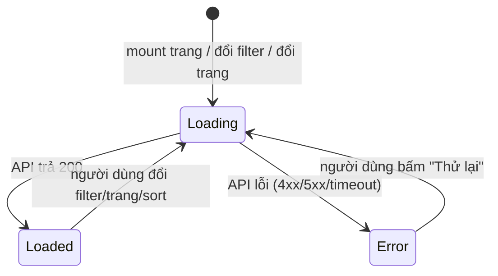
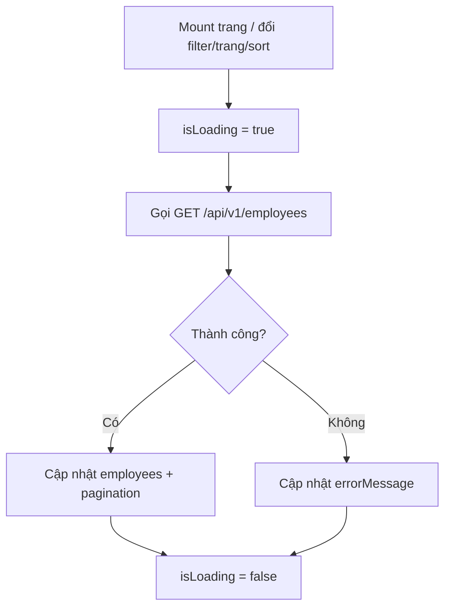
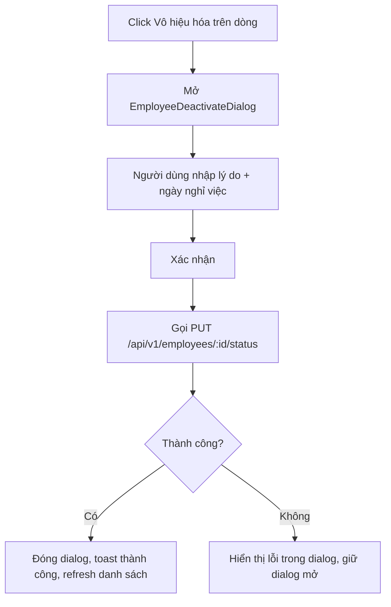
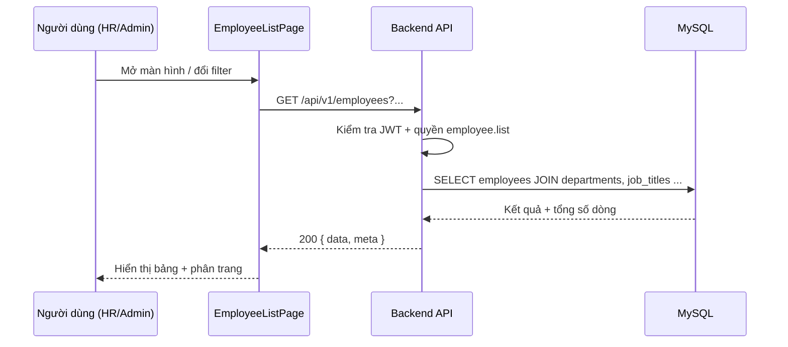
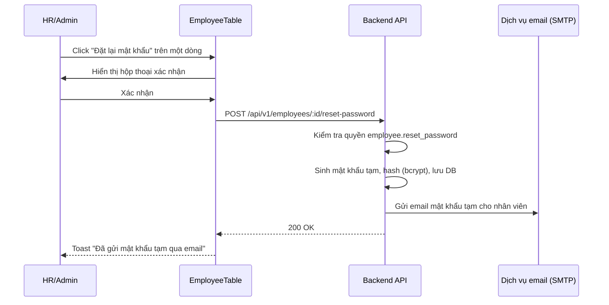

# Danh sách nhân viên — Tài liệu thiết kế chi tiết

**Dự án**: SSV HRM
**Chức năng đối tượng**: Danh sách nhân viên (SCR-04 — chế độ danh sách, F-002)
**Phase**: Phase 1
**Ngày tạo**: 2026-07-09
**Cập nhật lần cuối**: 2026-07-09

---

## Mục lục

1. [Tổng quan](#tổng-quan)
2. [Cấu trúc component](#cấu-trúc-component)
3. [Quản lý state](#quản-lý-state)
4. [Event handler](#event-handler)
5. [Business logic](#business-logic)
6. [Luồng dữ liệu](#luồng-dữ-liệu)
7. [Sequence diagram](#sequence-diagram)
8. [Transaction CSDL](#transaction-csdl)
9. [Xử lý lỗi](#xử-lý-lỗi)
10. [Yêu cầu hiệu năng](#yêu-cầu-hiệu-năng)
11. [Yêu cầu an toàn](#yêu-cầu-an-toàn)
12. [Tài liệu liên quan](#tài-liệu-liên-quan)

---

## Tổng quan

### **Tóm tắt chức năng**
Trang danh sách nhân viên cho phép HR/Admin tìm kiếm, lọc, sắp xếp, phân trang và thực hiện các hành động quản lý (xem/sửa/đặt lại mật khẩu/chuyển trạng thái nghỉ việc/xuất Excel) trên toàn bộ nhân viên của SSV tại 2 văn phòng Hà Nội và Huế.

### **Phạm vi Phase 1**
- Tải và hiển thị danh sách có phân trang server-side
- Tìm kiếm, lọc, sắp xếp
- Ẩn/hiện cột và nút hành động theo mã quyền RBAC
- Xuất Excel theo điều kiện lọc hiện tại

### **Phạm vi Phase 2**
- Lọc theo thuộc tính mở rộng EAV (F-003)
- Quick-view hồ sơ dạng side panel

### **Vị trí trong luồng nghiệp vụ**
Đây là màn hình lối vào (entry point) của toàn bộ nghiệp vụ Quản lý hồ sơ nhân viên (M02) — mọi thao tác tạo/sửa/đặt lại mật khẩu/chuyển trạng thái nghỉ việc đều bắt đầu từ đây.

---

## Cấu trúc component

### **Design tokens áp dụng cho màn hình**

Màn hình thuộc nhóm "internal enterprise admin / data table" — áp dụng định hướng phong cách **Trust & Authority + Minimalism** (tra cứu qua `ui-ux-pro-max`, nhóm sản phẩm gần nhất: *Job Board/Recruitment* và *Analytics/Admin Dashboard*), không dùng phong cách trang trí (glassmorphism, gradient nổi bật) vì đây là công cụ nội bộ ưu tiên tốc độ đọc dữ liệu và độ tin cậy hơn là gây ấn tượng thị giác.

| Token | Giá trị | Vai trò |
|---|---|---|
| `--color-primary` | `#0369A1` | Nút chính, link, trạng thái active của filter |
| `--color-primary-dark` | `#0C4A6E` | Text trên nền primary nhạt, tiêu đề nhấn |
| `--color-success` | `#16A34A` | Badge "Đang làm việc" |
| `--color-warning` | `#D97706` | Badge "Tạm nghỉ" |
| `--color-neutral` | `#64748B` | Badge "Đã nghỉ việc", text phụ |
| `--color-danger` | `#DC2626` | Hành động "Vô hiệu hóa", thông báo lỗi |
| `--color-surface` | `#F8FAFC` | Nền trang, nền filter bar |
| Font chữ chính | `Inter` (400/500/600) | Toàn bộ UI (hỗ trợ tốt tiếng Việt có dấu) |
| Font dự phòng CJK | `Noto Sans JP` | Khi locale = `ja`, áp dụng cho nhãn/label tiếng Nhật |
| Bảng dữ liệu | `q-table dense`, khoảng cách dòng theo thang 8px | Ưu tiên hiển thị nhiều dòng/màn hình (đặc trưng dashboard mật độ cao) |

**Căn cứ**: `.agents/skills/ui-ux-pro-max/SKILL.md` (mục Style Selection, Typography & Color) và `.agents/skills/frontend-design/SKILL.md` (nguyên tắc "ground it in the subject" — công cụ tra cứu nhân sự nội bộ, không phải sản phẩm tiêu dùng).

### **Component chung (tham chiếu)**
Xem `02_Technical_Design/07_Tech_Stack_Common_Specs.md` (tài liệu mẫu — dùng cho tham chiếu Quasar component chuẩn: `q-table`, `q-select`, `q-input`, `q-btn`, `q-dialog`).

### **Component riêng của màn hình**

| Component | Đường dẫn | Vai trò | Props chính |
|---|---|---|---|
| `EmployeeListPage` | `frontend/src/pages/employee/EmployeeListPage.vue` | Trang chính, điều phối state | - |
| `EmployeeFilterBar` | `frontend/src/pages/employee/components/EmployeeFilterBar.vue` | Ô tìm kiếm + các filter | `modelValue: EmployeeListFilter`, `departments: Option[]`, `jobTitles: Option[]` |
| `EmployeeTable` | `frontend/src/pages/employee/components/EmployeeTable.vue` | Bảng dữ liệu + phân trang + hành động dòng | `rows: EmployeeListItem[]`, `loading: boolean`, `pagination: PaginationMeta`, `permissions: EmployeePermissions` |
| `EmployeeStatusBadge` | `frontend/src/components/business/EmployeeStatusBadge.vue` | Badge trạng thái màu theo `status` | `status: EmployeeStatus` |
| `EmployeeDeactivateDialog` | `frontend/src/pages/employee/components/EmployeeDeactivateDialog.vue` | Hộp thoại xác nhận chuyển trạng thái nghỉ việc | `employee: EmployeeListItem` |

### **Cây component**
```
EmployeeListPage.vue
├── EmployeeFilterBar.vue
├── EmployeeTable.vue
│   ├── EmployeeStatusBadge.vue (mỗi dòng)
│   └── q-btn (hành động, hiển thị theo quyền)
└── EmployeeDeactivateDialog.vue (mở khi bấm "Vô hiệu hóa")
```

---

## Quản lý state

### **Nguyên tắc áp dụng**
State của màn hình này chỉ dùng trong `EmployeeListPage` (không có màn hình khác cần dùng lại filter/kết quả tìm kiếm này) → dùng **local state (`ref`)**, **không tạo Pinia store riêng** cho màn danh sách. Đây là quy ước chung của dự án: chỉ tạo store khi state cần chia sẻ giữa nhiều trang (ví dụ `authStore`), còn state riêng một trang thì giữ local.

### **State local (trong `EmployeeListPage.vue`)**

| Biến | Kiểu | Giá trị khởi tạo | Mô tả |
|---|---|---|---|
| `employees` | `EmployeeListItem[]` | `[]` | Danh sách nhân viên trang hiện tại |
| `pagination` | `PaginationMeta` | `{ page: 1, per_page: 20, total: 0, total_pages: 0 }` | Thông tin phân trang |
| `filter` | `EmployeeListFilter` | `{ status: ['ACTIVE'] }` | Điều kiện tìm kiếm/lọc hiện tại |
| `isLoading` | `boolean` | `false` | Trạng thái tải danh sách |
| `isExporting` | `boolean` | `false` | Trạng thái đang xuất Excel |
| `errorMessage` | `string \| null` | `null` | Thông báo lỗi khi tải thất bại |
| `deactivateTarget` | `EmployeeListItem \| null` | `null` | Nhân viên đang được chọn để chuyển trạng thái nghỉ việc |

### **State toàn cục (Pinia — tham chiếu, không tạo mới)**

| Store | State | Kiểu | Mô tả |
|---|---|---|---|
| `authStore` | `permissions` | `Record<string, PermissionValue>` | Bảng quyền của người dùng hiện tại, dùng để tính `EmployeePermissions` (computed) cho màn này |

### **Sơ đồ trạng thái tải dữ liệu**



---

## Event handler

### **Danh sách sự kiện**

| Sự kiện | Handler | Xử lý |
|---|---|---|
| Mount trang | `onMounted` | Gọi `fetchDepartments()`, `fetchJobTitles()`, `fetchEmployees()` |
| Gõ ô tìm kiếm (debounce 400ms) | `handleSearchInput(value)` | Cập nhật `filter.q`, reset trang 1, gọi `fetchEmployees()` |
| Đổi filter (phòng ban/chức vụ/văn phòng/trạng thái) | `handleFilterChange(patch)` | Merge `filter`, reset trang 1, gọi `fetchEmployees()` |
| Bấm "Xóa lọc" | `handleResetFilter()` | Đặt `filter` về giá trị mặc định, gọi `fetchEmployees()` |
| Click header cột có sort | `handleSort(column)` | Cùng cột: đổi `asc`↔`desc`; khác cột: đặt `asc`, gọi `fetchEmployees()` |
| Đổi trang / số dòng mỗi trang | `handlePageChange(page, perPage)` | Cập nhật `pagination`, gọi `fetchEmployees()` |
| Click "Xem" trên dòng | `handleView(employee)` | `router.push({ name: 'employee-detail', params: { id: employee.id } })` |
| Click "Sửa" trên dòng | `handleEdit(employee)` | `router.push({ name: 'employee-edit', params: { id: employee.id } })` |
| Click "Đặt lại mật khẩu" | `handleResetPassword(employee)` | Mở `q-dialog` xác nhận → gọi API → toast kết quả |
| Click "Vô hiệu hóa" | `handleDeactivate(employee)` | Gán `deactivateTarget = employee`, mở `EmployeeDeactivateDialog` |
| Xác nhận trong `EmployeeDeactivateDialog` | `handleConfirmDeactivate(reason, resignedAt)` | Gọi `PUT /api/v1/employees/:id/status`, đóng dialog, refresh danh sách |
| Click "Xuất Excel" | `handleExport()` | Xem chi tiết ở [Business logic §Xuất Excel](#xuất-excel-theo-ngưỡng-đồng-bộbất-đồng-bộ) |

### **Chi tiết: `fetchEmployees()`**

**Luồng**:
1. Đặt `isLoading = true`, `errorMessage = null`.
2. Gọi `GET /api/v1/employees` với query dựng từ `filter` + `pagination.page` + `pagination.per_page` + `sortBy`/`sortOrder`.
3. Thành công: cập nhật `employees = response.data`, `pagination = response.meta`.
4. Lỗi: cập nhật `errorMessage` theo bảng ở [Xử lý lỗi](#xử-lý-lỗi); nếu `401` → điều hướng sang màn đăng nhập.
5. `isLoading = false`.

**Ghi chú**: mã nguồn tham khảo `frontend/src/pages/employee/EmployeeListPage.vue`.

---

## Business logic

### **Tính toán quyền hiển thị (RBAC)**

- **Nguồn**: `authStore.permissions['employee']` — cấu trúc JSON theo đúng quy ước ở F-025: `{ "employee": { "list": "FULL", "create": "FULL", "edit": "FULL", "delete": "FULL", "export": "FULL", "view_role": "FULL", "reset_password": "FULL" } }`.
- **Computed** `employeePermissions`: map từng action sang `boolean` (`FULL` → `true`, mọi giá trị khác hoặc thiếu key → `false`).
- **Quy tắc**: nút/cột không có quyền → **ẩn hoàn toàn** khỏi DOM (không render ở dạng `disabled`), theo nguyên tắc bảo mật tại NFR 3.2.
- **Kiểm tra kép**: quyền cũng được kiểm tra lại ở tầng service khi gọi API tương ứng — FE chỉ là lớp UX, không phải lớp bảo mật duy nhất.

### **Debounce tìm kiếm**
- Độ trễ: `400ms` sau lần gõ cuối.
- Hủy request đang chạy (nếu có) khi có request mới hơn để tránh hiển thị sai dữ liệu do phản hồi trả về không đúng thứ tự (race condition) — dùng cơ chế hủy của client HTTP theo `AbortController`/tương đương.

### **Xuất Excel theo ngưỡng đồng bộ/bất đồng bộ**

**Luồng**:
1. `isExporting = true`.
2. Gọi `GET /api/v1/employees/export` kèm toàn bộ `filter` hiện tại.
3. Nếu response `200` (đồng bộ): tải file trực tiếp.
4. Nếu response `202` (bất đồng bộ, `job_id`): poll `GET /api/v1/exports/:job_id` mỗi 2 giây tới khi `status = DONE` (tải file) hoặc `FAILED` (hiển thị lỗi), timeout sau 2 phút.
5. `isExporting = false`.

**Ghi chú**: ngưỡng chuyển từ đồng bộ sang bất đồng bộ do backend quyết định (không phải FE) — xem `../api/01_Employee_API.md` §2.

### **Quy tắc badge trạng thái**

| `status` | Nhãn hiển thị | Màu |
|---|---|---|
| `ACTIVE` | Đang làm việc | `--color-success` |
| `ON_LEAVE` | Tạm nghỉ | `--color-warning` |
| `RESIGNED` | Đã nghỉ việc | `--color-neutral` |

**Ghi chú**: mã nguồn logic tính toán tham khảo `frontend/src/utils/employee-status.ts`.

---

## Luồng dữ liệu

### **Luồng tải danh sách**



### **Luồng chuyển trạng thái nghỉ việc**



---

## Sequence diagram

### **Tải danh sách nhân viên (luồng chính)**



### **Đặt lại mật khẩu**



---

## Transaction CSDL

### **Chuyển trạng thái nghỉ việc**

**Phạm vi**:
```
BEGIN;
  UPDATE employees SET status = 'RESIGNED', resigned_at = :resigned_at, resigned_reason = :reason, updated_at = NOW() WHERE id = :id;
  INSERT INTO employee_status_history (employee_id, from_status, to_status, reason, changed_by, changed_at) VALUES (...);
COMMIT;
```

**Bảng sử dụng**:
- `employees`: cập nhật trạng thái
- `employee_status_history`: lưu lịch sử thay đổi trạng thái (phục vụ kiểm toán — **[Cần xác nhận / To be confirmed]**: bảng này chưa có trong thiết kế CSDL chính thức, cần bổ sung khi thực hiện Phase 2 của DB design)

**Điều kiện rollback**:
- Ghi `employee_status_history` thất bại → rollback toàn bộ, không đổi trạng thái nhân viên.
- Nhân viên đang có đơn nghỉ phép/OT/WFH ở trạng thái chờ duyệt → **[Cần xác nhận / To be confirmed]**: cần HR xác nhận có chặn chuyển trạng thái nghỉ việc trong trường hợp này hay không.

**Ghi chú**: SQL chi tiết tham khảo mã nguồn `backend/src/modules/employee/employee.repo.ts`.

---

## Xử lý lỗi

### **Lỗi API**

| Mã lỗi | Nguyên nhân | Thông báo cho người dùng | Hành động FE |
|---|---|---|---|
| 400 | Query/body không hợp lệ | "Điều kiện tìm kiếm/lọc không hợp lệ." | Hiển thị lỗi cạnh trường liên quan (nếu xác định được từ `errors[]`) |
| 401 | Token hết hạn/không hợp lệ | "Vui lòng đăng nhập lại." | Điều hướng sang màn đăng nhập |
| 403 | Không có quyền `employee.*` | "Bạn không có quyền thực hiện thao tác này." | Toast lỗi, không thay đổi state |
| 404 | Nhân viên không tồn tại (khi thao tác trên 1 dòng vừa bị người khác xóa/đổi) | "Không tìm thấy nhân viên. Danh sách sẽ được làm mới." | Gọi lại `fetchEmployees()` |
| 500 | Lỗi hệ thống | "Đã có lỗi xảy ra, vui lòng thử lại." | Hiển thị nút "Thử lại" |
| Timeout | Mạng chậm/mất kết nối | "Kết nối quá chậm, vui lòng thử lại." | Hiển thị nút "Thử lại" |

### **Cách hiển thị**
- Lỗi tải danh sách (toàn trang): banner lỗi trong vùng bảng, có nút "Thử lại".
- Lỗi thao tác đơn lẻ (reset password, đổi trạng thái): `q-notify` toast, góc trên phải, tự ẩn sau 5 giây (thao tác có ảnh hưởng dữ liệu nên giữ lâu hơn mức 3–5s tiêu chuẩn của thông báo thường).
- Lỗi validate query (400 với `errors[]`): map vào từng ô filter tương ứng nếu có thể xác định trường.

---

## Yêu cầu hiệu năng

### **Thời gian phản hồi**

| Mục | Mục tiêu | Ghi chú |
|---|---|---|
| Tải danh sách lần đầu | ≤ 1s (p95) | Theo NFR 3.1 (Response API < 1s p95 cho CRUD) |
| Tìm kiếm/lọc/sắp xếp | ≤ 1s (p95) | - |
| Xuất Excel (đồng bộ) | ≤ 3s cho ≤ 5.000 dòng | Vượt ngưỡng → chuyển bất đồng bộ |

### **Chiến lược tối ưu**
- Đánh index trên `employee_code`, `department_id`, `job_title_id`, `status`, `office` (phục vụ lọc/sắp xếp) — cần đưa vào thiết kế CSDL chính thức tại `03_Database_Design/`.
- Phân trang server-side (không tải toàn bộ danh sách về FE).
- Debounce tìm kiếm 400ms để giảm số lượng request không cần thiết.

---

## Yêu cầu an toàn

### **Xác thực & phân quyền**
- JWT access token (15 phút) + refresh token (cookie `httpOnly`, `SameSite=Strict`) theo NFR 3.2.
- Kiểm tra quyền `employee.*` ở tầng service cho **mọi** endpoint, không chỉ ở FE.
- Trường `role` (vai trò hệ thống) chỉ trả về khi có quyền `employee.view_role`.

### **Bảo vệ dữ liệu cá nhân**
- Email, số điện thoại nhân viên là dữ liệu cá nhân — không log giá trị thật ở log ứng dụng (redaction theo NFR 3.6); chỉ log `employee_code`/`id` khi cần truy vết.
- File Excel xuất ra chứa dữ liệu cá nhân của nhiều nhân viên → ghi audit log (ai xuất, khi nào, điều kiện lọc) theo yêu cầu ở `../api/01_Employee_API.md`.

### **Chống tấn công phổ biến**
- SQL injection: dùng Prisma (parameterized query) — không dựng câu truy vấn bằng nối chuỗi.
- XSS: Vue tự động escape khi render; không dùng `v-html` với dữ liệu nhân viên (họ tên, ghi chú...) nếu chưa sanitize.

**Tham chiếu**: `02_Technical_Design/05_Security_Design.md`.

---

## Tài liệu liên quan

### **Thiết kế màn hình**
- `../screen/01_Employee_List.md`

### **Thiết kế API**
- `../api/01_Employee_API.md`

### **Thiết kế CSDL**
- `../../03_Database_Design/` — bảng `employees`, `departments`, `job_titles`, `employee_status_history` (chưa chính thức hóa — xem các mục [Cần xác nhận] trong tài liệu này và tài liệu màn hình)

### **Yêu cầu gốc**
- `../../01_Business_Process/requirements/HRM_Requirements.md`

---

## Cập nhật lần cuối

| Ngày | Phiên bản | Nội dung |
|---|---|---|
| 2026-07-09 | v1.0.0 | Khởi tạo tài liệu thiết kế chi tiết cho màn Danh sách nhân viên |

---

**Tác giả**: HRM Design Team
**Cập nhật lần cuối**: 2026-07-09
